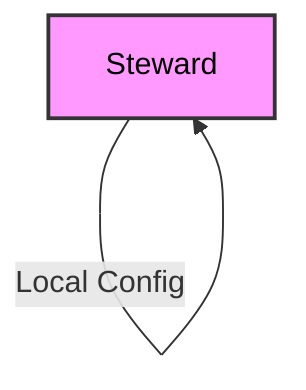
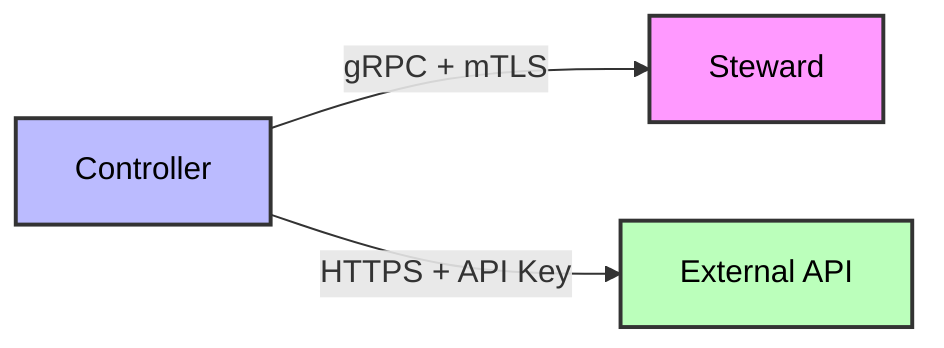
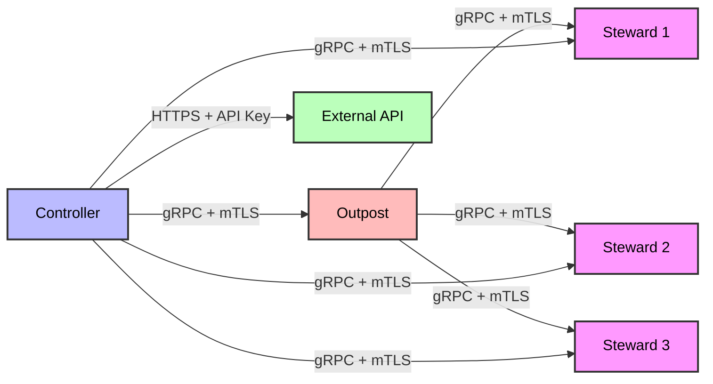
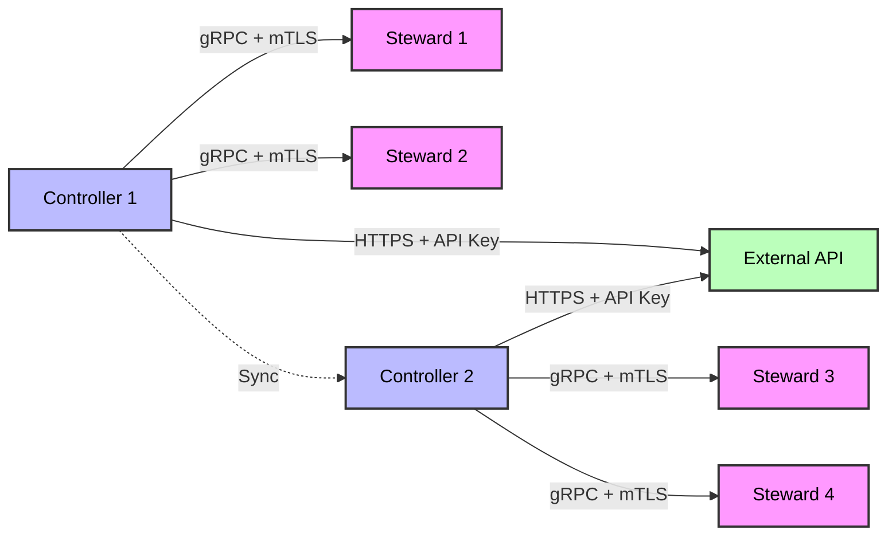
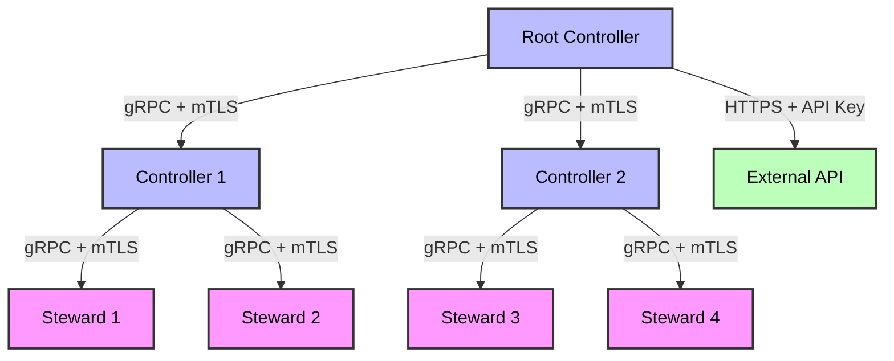

# Component Interactions

This document details how the various components in the CFGMS architecture interact with each other, including communication patterns, data flow, and deployment scenarios.

## Overview

CFGMS is built around a set of core components that work together to provide configuration management capabilities. The interactions between these components are designed to be efficient, secure, and resilient, with support for various deployment scenarios.

## Communication Patterns

### Controller-Steward Communication

The Controller and Steward communicate using gRPC with mutual TLS (mTLS) authentication:

- **Protocol**: gRPC with Protocol Buffers
- **Authentication**: Mutual TLS (mTLS)
- **Encryption**: TLS 1.3
- **Direction**: Bidirectional (Controller initiates, Steward responds)
- **Frequency**: Regular polling and event-driven updates
- **Direct Connection**: Stewards can communicate directly with Controllers without requiring an Outpost intermediary

### Controller-Outpost Communication

The Controller and Outpost communicate using the same protocol as Controller-Steward:

- **Protocol**: gRPC with Protocol Buffers
- **Authentication**: Mutual TLS (mTLS)
- **Encryption**: TLS 1.3
- **Direction**: Bidirectional (Controller initiates, Outpost responds)
- **Frequency**: Regular polling and event-driven updates
- **Role**: Outpost serves as an optional intermediary for caching and proxy purposes

### Outpost-Steward Communication

The Outpost and Steward communicate using the same protocol as Controller-Steward:

- **Protocol**: gRPC with Protocol Buffers
- **Authentication**: Mutual TLS (mTLS)
- **Encryption**: TLS 1.3
- **Direction**: Bidirectional (Outpost initiates, Steward responds)
- **Frequency**: Regular polling and event-driven updates
- **Failover**: If Outpost is unreachable, Steward can communicate directly with Controller

### External API Communication

The Controller provides a REST API for external access:

- **Protocol**: HTTPS
- **Authentication**: API Key
- **Encryption**: TLS 1.3
- **Direction**: Client-server (Client initiates, Controller responds)
- **Frequency**: On-demand

## Data Flow

### Configuration Data Flow

1. **Configuration Creation/Update**:
   - External client creates/updates configuration via REST API
   - Controller validates and stores configuration
   - Controller distributes configuration to relevant Stewards (directly or via Outpost)

2. **Configuration Deployment**:
   - Controller detects change and pushes updated config to Steward (directly or via Outpost)
   - Steward requests configuration from Controller/Outpost if needed
   - Controller/Outpost provides configuration
   - Steward applies configuration to managed resources

3. **Configuration Validation**:
   - Steward validates current state against configuration
   - Steward reports validation results to Controller (directly or via Outpost)
   - Controller aggregates and reports validation status

### DNA Data Flow

1. **DNA Collection**:
   - Steward collects DNA (system-specific metadata)
   - Steward reports DNA to Controller (directly or via Outpost)
   - Controller stores DNA in database

2. **DNA Usage**:
   - Controller uses DNA for targeting operations
   - Controller uses DNA for filtering and querying
   - Controller enables DNA-driven automation

### Module Data Flow

1. **Module Distribution**:
   - Controller distributes modules to Stewards (directly or via Outpost)
   - Stewards cache modules locally
   - Stewards load and execute modules

2. **Module Execution**:
   - Steward executes modules based on configuration
   - Module reports execution results to Steward
   - Steward reports results to Controller (directly or via Outpost)

## Deployment Scenarios

### Basic Deployment (Steward-Only)

In the most basic deployment, a single Steward operates independently with local configuration:

### Typical Deployment (Controller-Steward)

Standard deployment with direct communication between Controller and Steward:

### Large Environment (Controller-Outpost-Steward)

Large deployments with Outpost acting as an optional local proxy-cache:

### High Availability Deployment (Multiple Controllers)

High availability deployment with multiple Controllers:

### Distributed Deployment (Hierarchical Controllers)

Distributed deployment with hierarchical Controllers:

## Interaction Patterns

### Configuration Management

1. **Configuration Update**:
   - External client updates configuration via REST API
   - Controller validates and stores configuration
   - Controller identifies affected Stewards
   - Controller distributes configuration to Stewards (directly or via Outpost)
   - Stewards apply configuration to managed resources
   - Stewards report results to Controller (directly or via Outpost)
   - Controller aggregates and reports results

2. **Configuration Validation**:
   - Controller schedules validation
   - Controller distributes validation request to Stewards (directly or via Outpost)
   - Stewards validate current state against configuration
   - Stewards report validation results to Controller (directly or via Outpost)
   - Controller aggregates and reports validation status

### Workflows

The Workflows are a powerful workflow automation system that acts as the glue between various systems, enabling complex automation and data sync across different platforms and services.

#### Core Concepts

1. **Workflows**: Defined sequences of operations that automate tasks across multiple systems
2. **Tools**: Standardized integrations that provide consistent interfaces to external systems and APIs
3. **Triggers**: Events that initiate workflow execution (webhooks, schedules, manual triggers)
4. **Actions**: Operations performed by tools within a workflow
5. **Data Flow**: How data moves between tools and steps in a workflow
6. **Error Handling**: How workflows handle failures and retries
7. **Conditional Logic**: Decision points that determine workflow branching

#### Workflow Execution

1. **Workflow Trigger**:
   - Workflow is triggered by an event (webhook, schedule, manual, or Module monitor)
   - Controller identifies the workflow to execute
   - Controller initializes the workflow execution environment
   - Controller begins executing workflow steps

2. **Tool Execution**:
   - Controller selects the appropriate tool for each step
   - Tool executes the requested action (API call, Steward command, etc.)
   - Tool returns results to the Controller
   - Controller passes results to the next step

3. **Workflow Completion**:
   - Controller executes all workflow steps
   - Controller handles any errors or retries
   - Controller reports workflow completion status
   - Controller stores workflow execution history

#### Integration with Stewards

The Workflow Engine can interact with Stewards to perform configuration management tasks:

1. **Steward Command Execution**:
   - Workflow includes a step to execute a command on a Steward
   - Controller identifies the target Steward(s)
   - Controller sends the command to the Steward(s) (directly or via Outpost)
   - Steward executes the command and reports results
   - Controller passes results to the next workflow step

2. **Configuration Updates**:
   - Workflow includes a step to update configuration
   - Controller prepares the configuration update
   - Controller sends the update to the target Steward(s) (directly or via Outpost)
   - Steward applies the configuration and reports results
   - Controller passes results to the next workflow step

#### Example Workflow: New Employee Onboarding

A typical workflow might automate the onboarding of a new employee:

1. **Trigger**: Webhook from HRMS system when a new employee is added
2. **User Creation**: Create user in Entra ID (or on-prem AD)
3. **License Purchase**: Purchase license from distributor
4. **License Assignment**: Assign license to the user
5. **Group Assignment**: Add user to appropriate groups
6. **Device Assignment**: Assign a device to the user in Intune
7. **Device Renaming**: Rename the device according to naming convention
8. **DNA Update**: Update DNA based on user assignment and groups
9. **Software Configuration**: Update endpoint configuration with required software
10. **Configuration Deployment**: Push updated configuration to the endpoint

This workflow demonstrates how the Workflow Engine can orchestrate complex processes across multiple systems, automating what would otherwise be manual tasks.

### DNA Management

1. **DNA Collection**:
   - Steward collects DNA
   - Steward reports DNA to Controller (directly or via Outpost)
   - Controller stores DNA in database
   - Controller uses DNA for targeting and filtering

2. **DNA Updates**:
   - Steward detects DNA changes
   - Steward reports changes to Controller (directly or via Outpost)
   - Controller updates DNA in database
   - Controller triggers relevant workflows

## Outpost as Optional Intermediary

### Outpost Role and Benefits

The Outpost serves as an optional intermediary in the CFGMS architecture with the following benefits:

1. **File Caching**: Outposts can cache configuration files, modules, and other resources to reduce bandwidth usage and improve performance
2. **Local Proxy**: Outposts can act as a local proxy for Stewards in environments with limited internet connectivity
3. **Network Optimization**: Outposts can optimize network traffic by batching requests and responses
4. **Reduced Controller Load**: Outposts can handle routine requests, reducing the load on Controllers

### Steward-Controller Direct Communication

Stewards are designed to communicate directly with Controllers by default:

1. **Default Communication Path**: Stewards establish direct communication with Controllers
2. **Outpost as Optional Enhancement**: Outposts can be added to enhance performance but are not required
3. **Failover Mechanism**: If an Outpost is unreachable, Stewards automatically fail back to direct Controller communication

### Outpost Failover Scenarios

1. **Outpost Unreachable**: If an Outpost becomes unreachable, Stewards automatically communicate directly with Controllers
2. **Outpost Overloaded**: If an Outpost is overloaded, Stewards can communicate directly with Controllers
3. **Network Changes**: When network topology changes (e.g., laptop moves to different network), Stewards adapt their communication path
4. **Configuration Changes**: Stewards can be configured to bypass Outposts for certain types of requests

## Security Considerations

### Authentication and Authorization

- All component interactions use mutual TLS (mTLS) authentication
- External API access uses API key authentication
- Role-based access control (RBAC) is enforced for all operations
- API keys are scoped to specific operations and resources

### Data Protection

- All communication is encrypted using TLS 1.3
- Sensitive data is encrypted at rest
- Secrets are managed securely
- Audit logging is implemented for all operations

### Network Security

- Components communicate over secure channels
- Network segmentation is supported
- Firewall rules can be applied
- Proxy configurations are supported

## Version Information

- **Document Version:** 1.1
- **Last Updated:** 2024-04-17
- **Status:** Draft
