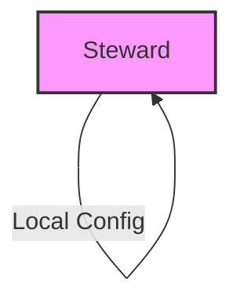
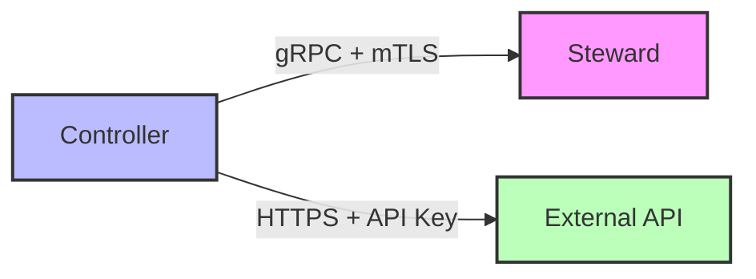
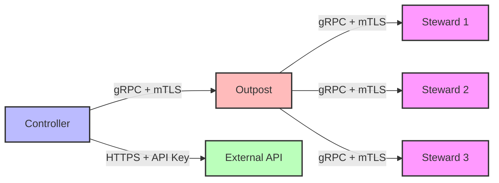
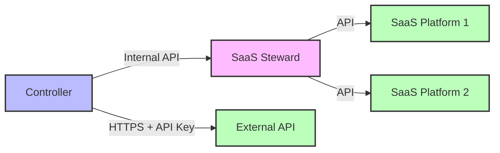
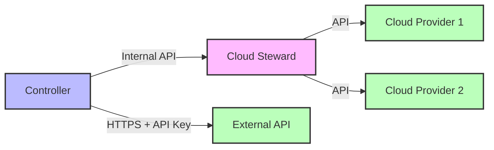

# CFGMS Components

This document provides a detailed overview of the core components in the CFGMS architecture, their responsibilities, and how they interact with each other.

## Core Components

### Controller

The **Controller** is the central management server of the CFGMS system.

**Primary Responsibilities:**
- Manages the entire configuration management system
- Distributes configuration data to Stewards and Outposts
- Processes and validates configuration changes
- Manages the tenant hierarchy
- Implements the REST API for external access
- Handles authentication and authorization
- Processes DNA (system-specific metadata) information

**Key Characteristics:**
- Designed for high availability and scalability
- Can handle 10,000+ Stewards per controller instance
- Supports geo-distributed deployment
- Implements robust security controls

**Technical Implementation:**
- Command communications with Stewards occur over gRPC with mTLS
- Protocol Buffers used for efficient data serialization
- Self-managed blue-green upgrades for Stewards
- Hierarchical Controller management for scaling
- Pluggable configuration storage (Git by default, database options for scale)

### Steward

The **Steward** is the cross-platform agent that runs on managed endpoints.

**Primary Responsibilities:**
- Executes configuration management tasks on endpoints
- Reports system state back to the Controller
- Implements the module system for resource management
- Collects and reports DNA (system-specific metadata)
- Enforces configuration compliance

**Key Characteristics:**
- Runs on Windows, Linux, and macOS
- Self-contained Go binary with minimal dependencies
- Self-healing architecture with blue-green upgrade capability
- Operates independently when disconnected from Controller
- Implements automatic recovery from failures

**Technical Implementation:**
- Standalone operation capability with local configuration
- Bootstrap functionality for initial Controller setup
- Health monitoring with self-diagnostic capabilities
- Automatic recovery procedures
- Metrics for task latency, configuration errors, and health status

### Outpost

The **Outpost** is a specialized proxy cache agent with network monitoring capabilities.

**Primary Responsibilities:**
- Acts as a proxy cache for Stewards on a network
- Monitors netflow and SNMP data from network devices
- Provides agentless monitoring of IoT devices on the network
- Caches configuration data and binaries for local Stewards
- Reduces network traffic between Stewards and Controller

**Key Characteristics:**
- Optimizes network usage in large deployments
- Enables monitoring of devices that cannot run a Steward
- Provides local caching for improved performance
- Implements network discovery capabilities
- Supports passive network monitoring

**Technical Implementation:**
- File caching for Stewards (v2)
- Network discovery and continuous monitoring (v2)
- SNMP monitoring (v2)
- Automated network documentation (v2)
- Passive network monitoring (v2)
- ML-based network baseline and anomaly detection (v2)
- Proxy Steward for agentless management (v2)

## Specialized Stewards

CFGMS includes specialized Steward variants that extend the core functionality to specific environments. Unlike the standard Steward, these specialized components are not installed on managed endpoints but are deployed as services that integrate with the Controller.

### SaaS Steward (v2)

The **SaaS Steward** is a specialized component for managing SaaS environments.

**Primary Responsibilities:**
- Manages SaaS application configurations
- Handles SaaS tenant administration
- Implements SaaS-specific modules
- Monitors SaaS application health
- Enforces SaaS compliance policies

**Key Characteristics:**
- Specialized for SaaS environment management
- Supports multiple SaaS platforms (e.g., M365, QuickBooks Online)
- Implements SaaS-specific security controls
- Provides SaaS tenant isolation
- Enables SaaS configuration automation

**Deployment Options:**
- As a Controller plugin (simplest deployment)
- As a standalone service alongside the Controller
- As a serverless function for cloud-native deployments
- As a containerized service for Kubernetes environments

### Cloud Steward (v2)

The **Cloud Steward** is a specialized component for managing cloud environments.

**Primary Responsibilities:**
- Manages cloud infrastructure configurations
- Handles cloud resource provisioning and lifecycle
- Implements cloud-specific modules
- Monitors cloud resource health and performance
- Enforces cloud compliance policies

**Key Characteristics:**
- Specialized for cloud environment management
- Supports multiple cloud platforms (e.g., AWS, Azure, GCP)
- Manages various cloud resource types:
  - Virtual Machines
  - Containers
  - Serverless Functions
  - Cloud Networks
  - Storage Resources
- Implements cloud-specific security controls
- Provides cloud resource isolation
- Enables cloud configuration automation

**Deployment Options:**
- As a Controller plugin (simplest deployment)
- As a standalone service alongside the Controller
- As a serverless function for cloud-native deployments
- As a containerized service for Kubernetes environments

## Component Interactions

### Basic Deployment (Steward-Only)
In the most basic deployment, a single Steward operates independently with local configuration:

### Typical Deployment (Controller-Steward)
Standard deployment with direct communication between Controller and Steward:

### Large Environment (Controller-Outpost-Steward)
Large deployments with Outpost acting as a local proxy-cache:

### SaaS Environment (Controller-SaaS Steward)
SaaS environment management with SaaS Steward:

### Cloud Environment (Controller-Cloud Steward)
Cloud environment management with Cloud Steward:

## Deployment Flexibility

CFGMS is designed to be both simple to get started with and capable of scaling to any size:

### Simple Deployment
- Single Controller with standard Stewards
- Minimal configuration required
- Automatic discovery and onboarding
- Zero-touch deployment options

### Scalable Deployment
- Distributed Controller architecture
- Hierarchical Controller management
- Outpost deployment for network optimization
- Specialized Stewards for different environments
- Multi-tenant support with recursive parent-child model

### Deployment Options for Specialized Stewards
- **Controller Plugin**: Simplest option, runs within the Controller process
- **Standalone Service**: Runs alongside the Controller for better resource isolation
- **Serverless Function**: Cloud-native deployment for automatic scaling
- **Containerized Service**: Kubernetes-friendly deployment for orchestrated environments

## Version Information
- **Document Version:** 1.0
- **Last Updated:** 2024-04-04
- **Status:** Draft 