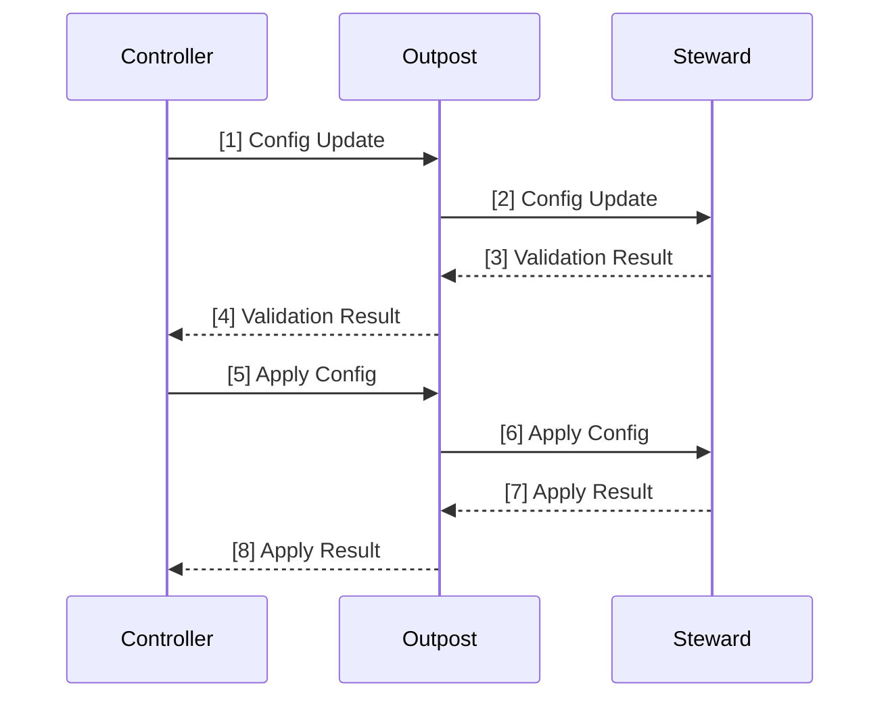
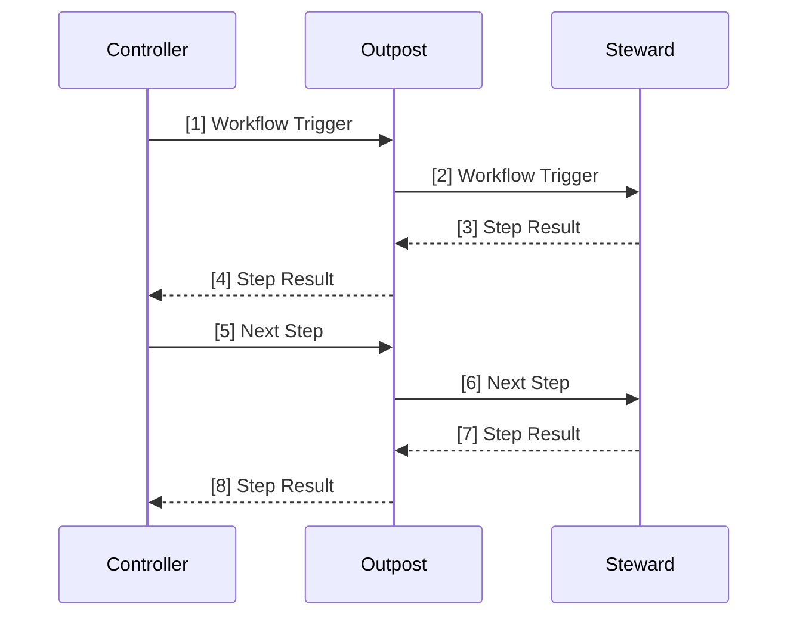
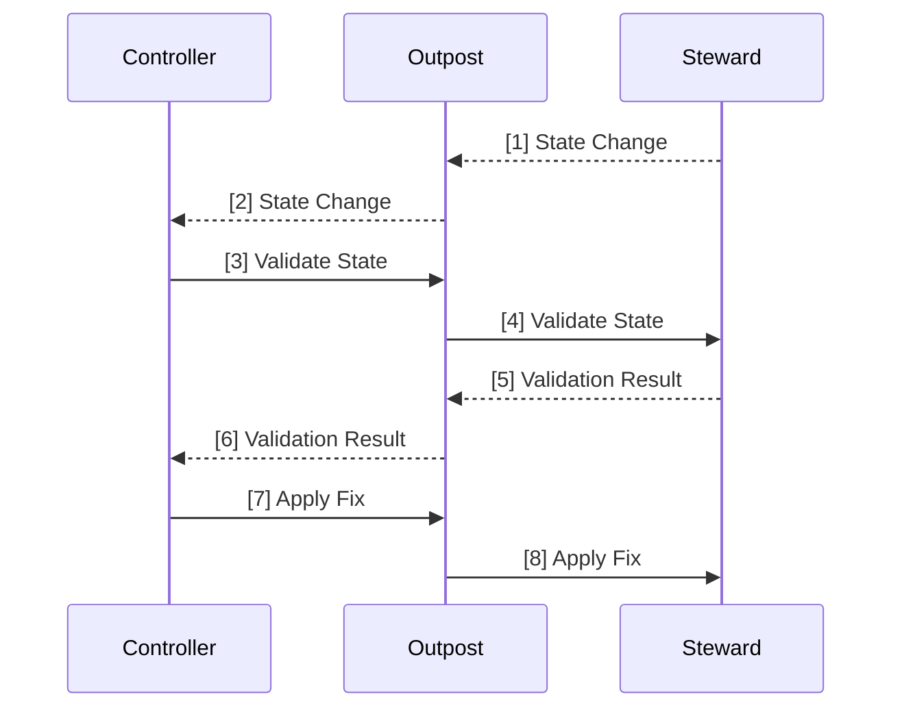
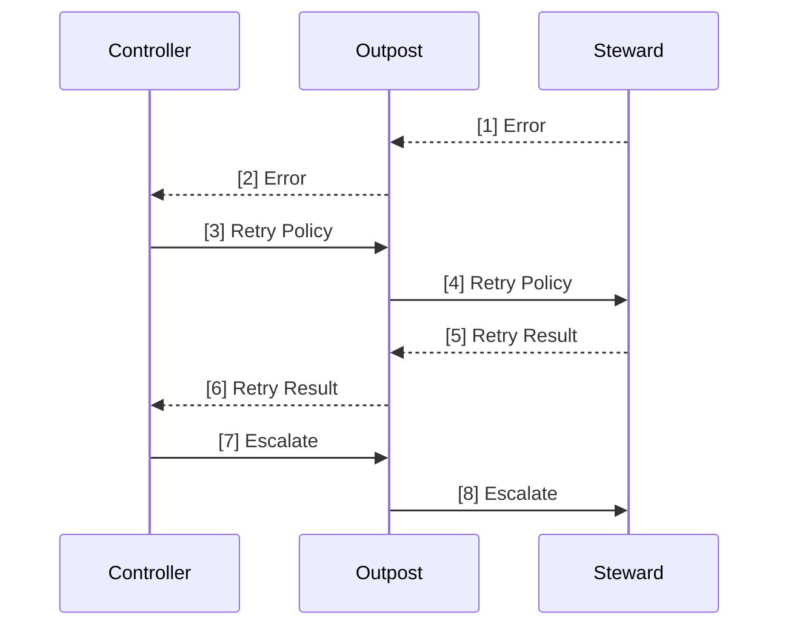
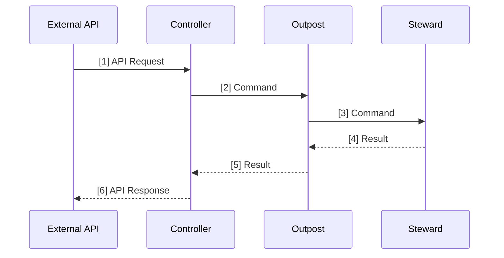
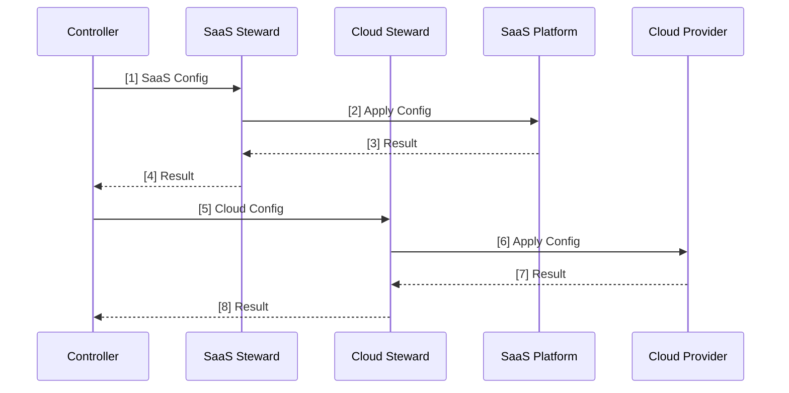
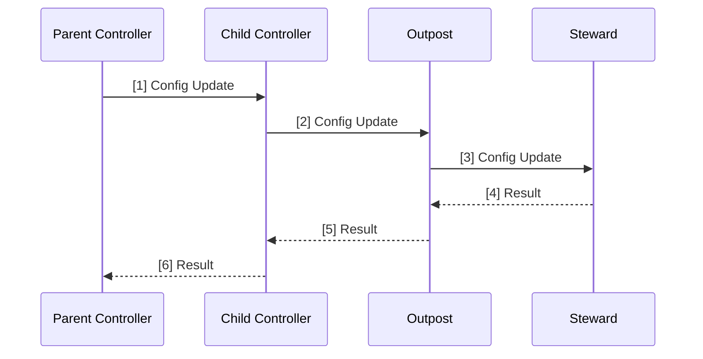

# Component Interaction Flows

## Configuration Application Flow

## Workflow Execution Flow

## State Change Detection Flow

## Error Handling Flow

## External API Interaction Flow

## Specialized Steward Interaction Flow

## Hierarchical Controller Interaction Flow

## Version Information

- Version: 1.1
- Last Updated: 2024-04-17
- Status: Draft
