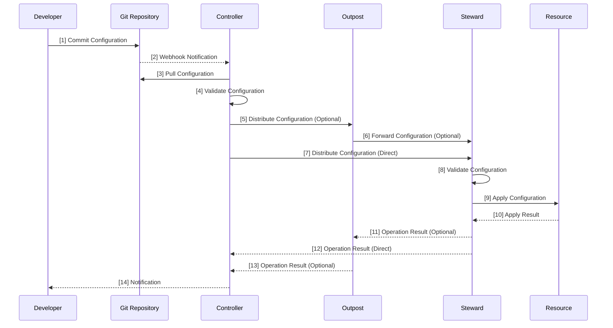
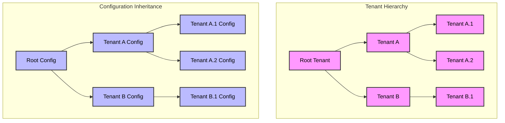
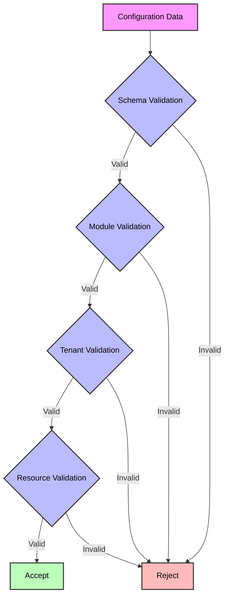
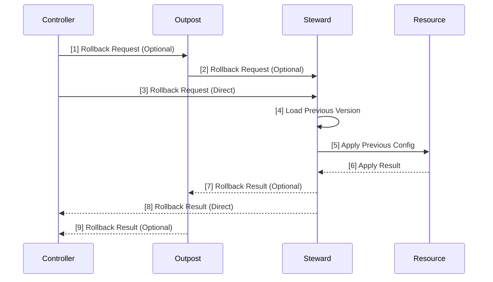
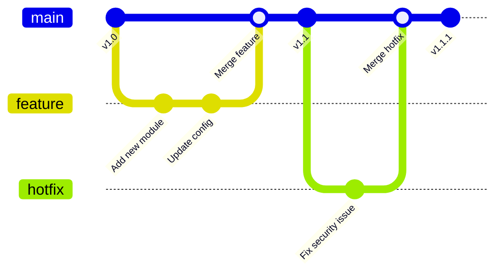
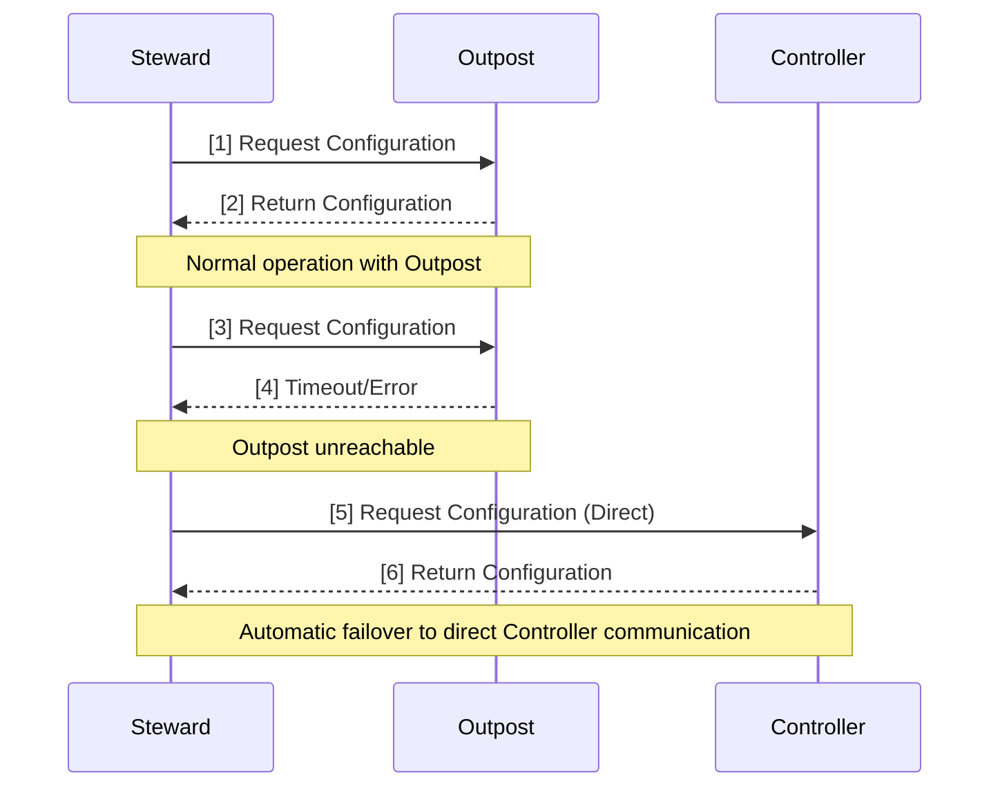

# Configuration Flow

## Configuration Data Flow

## Configuration Inheritance

## Configuration Validation Process

## Configuration Rollback Process

## Configuration Version Control

## Direct Communication and Failover

## Version Information

- Version: 1.1
- Last Updated: 2024-04-17
- Status: Draft
