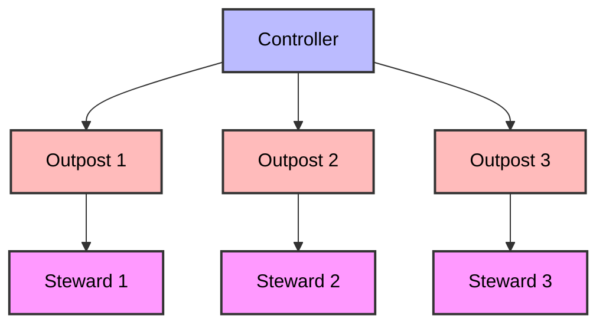
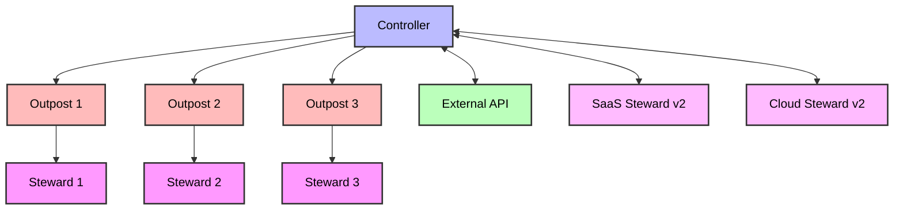
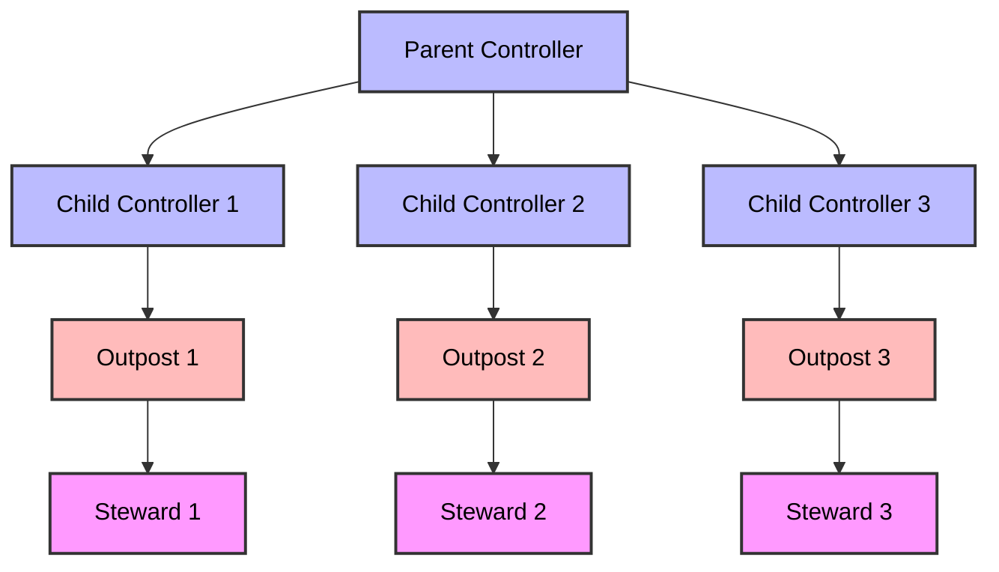
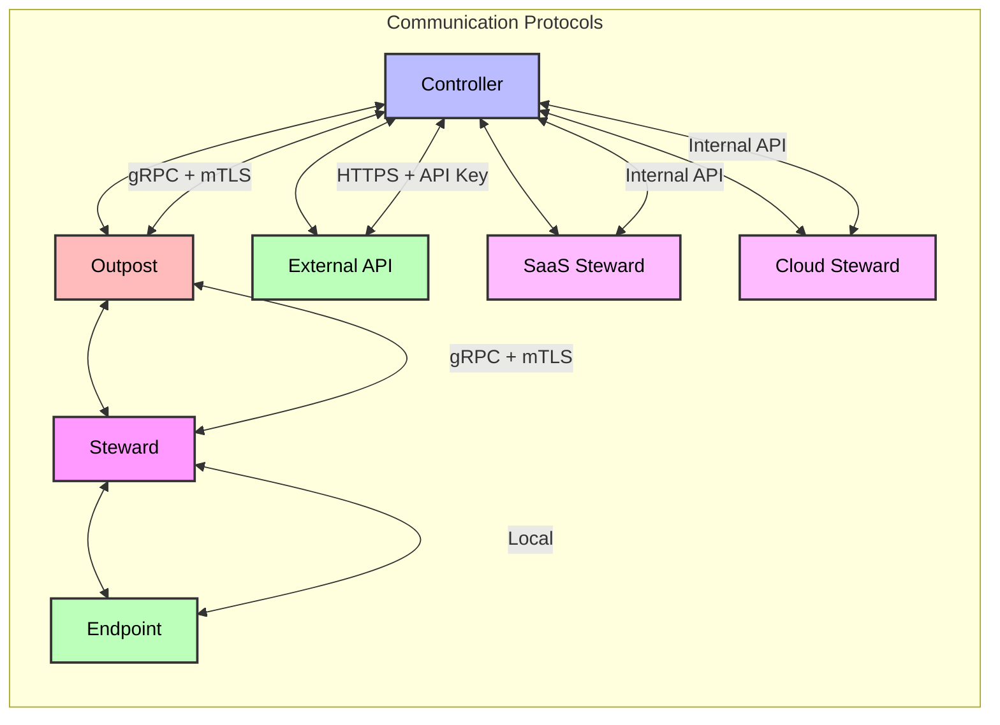
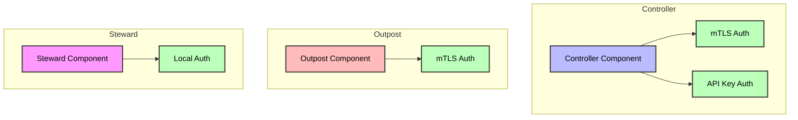

# Core Architecture Diagram

## System Overview

## External Access Layer

## Hierarchical Controller Architecture

## Component Relationships

### Controller

- Central management component
- Manages Outposts and Stewards
- Handles configuration distribution
- Controls workflow execution
- Manages multi-tenancy
- Provides external API access
- Supports hierarchical deployment

### Outpost

- Intermediate management layer
- Caches configurations and binaries
- Proxies commands to Stewards
- Handles agentless endpoints
- Manages network segments

### Steward

- Endpoint management component
- Executes configuration changes
- Runs workflows
- Reports state changes
- Maintains persistent connection to Controller/Outpost

### Specialized Stewards (v2)

- SaaS Steward: Manages SaaS environments
- Cloud Steward: Manages cloud infrastructure
- Deployable as Controller plugins or standalone services

## Communication Flow

## Security Boundaries

## Version Information

- Version: 1.3
- Last Updated: 2024-04-17
- Status: Draft
