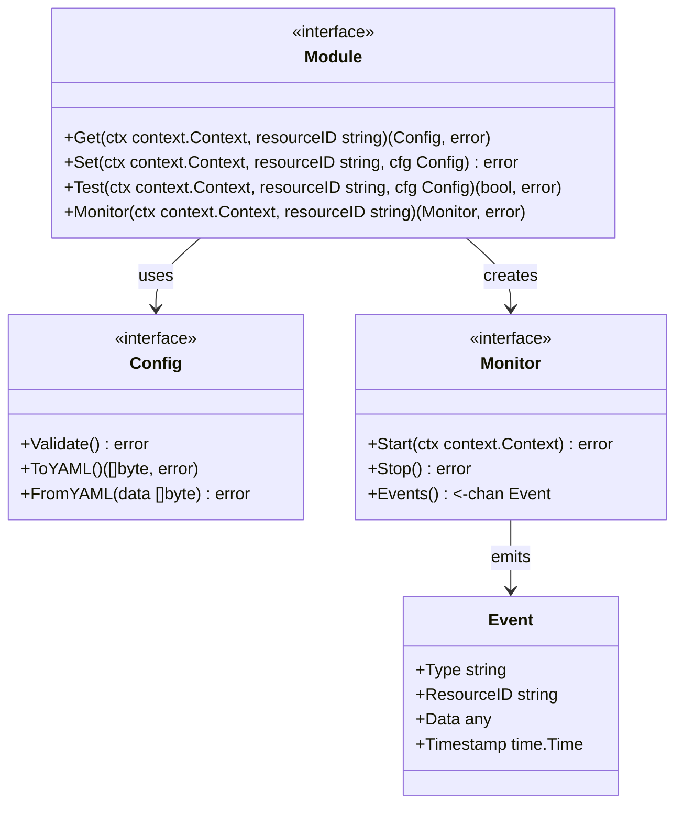
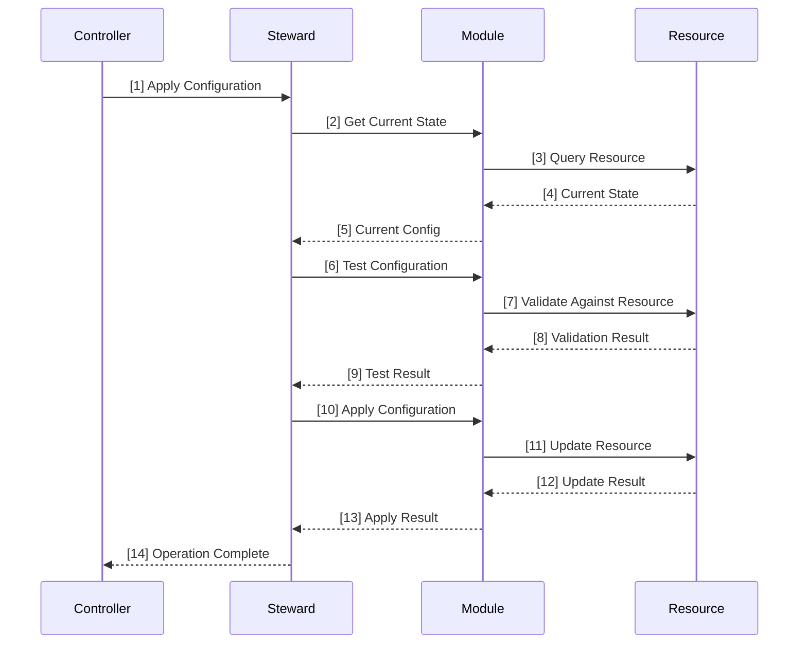
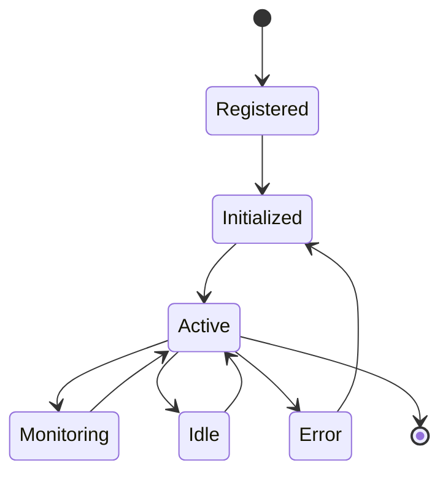
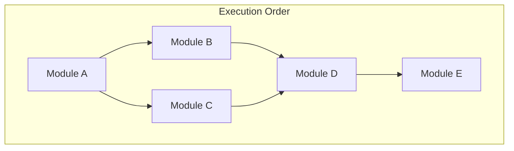

# Module System Architecture

## Module Interface Pattern

## Module Integration with Steward

## Module Lifecycle

## Module Dependency Resolution

## Version Information

- Version: 1.0
- Last Updated: 2024-04-17
- Status: Draft
