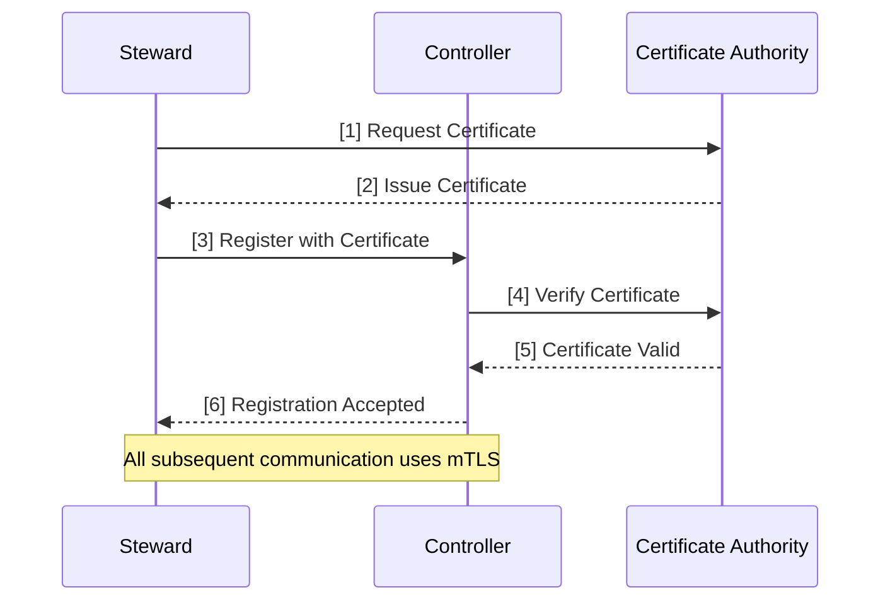
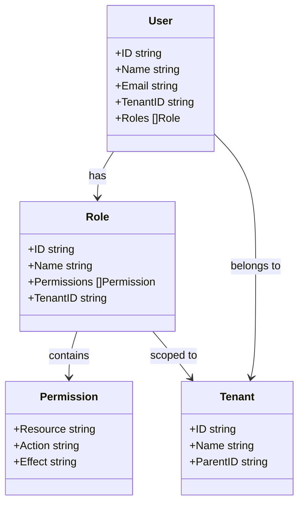
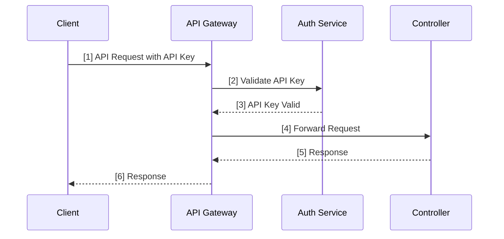
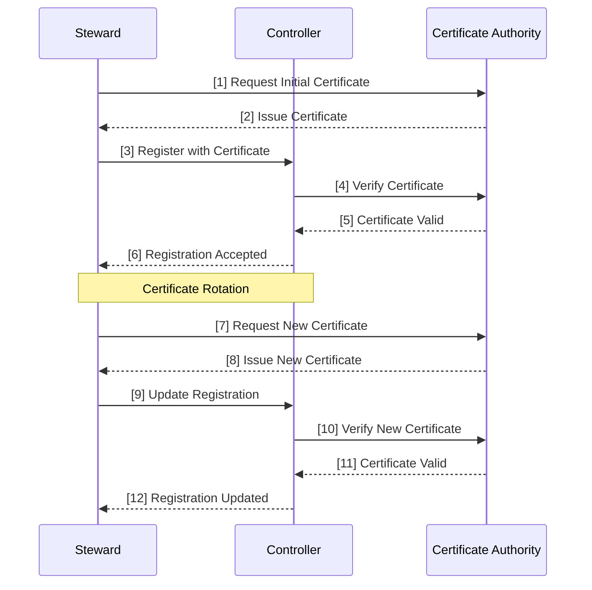
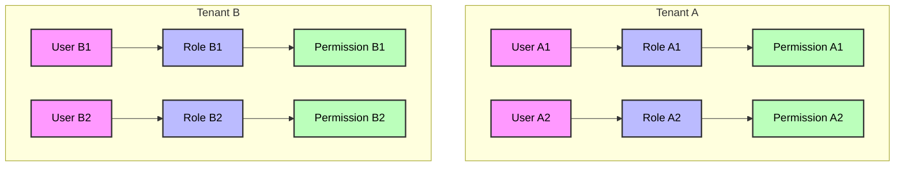

# Security Architecture

## Authentication Flow

## RBAC Implementation

## API Authentication Flow

## Certificate Management

## Multi-Tenant Security Isolation

## Version Information

- Version: 1.0
- Last Updated: 2024-04-17
- Status: Draft
