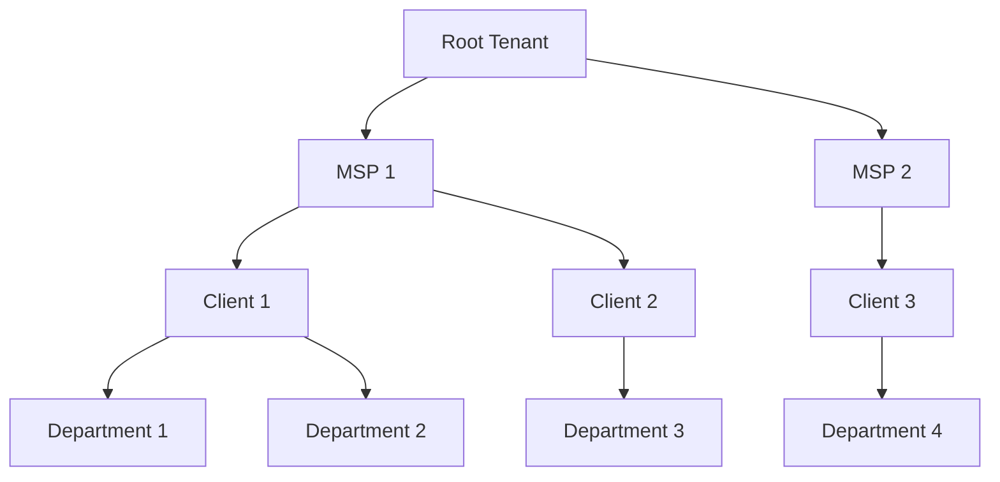

# Multi-Tenancy Overview

## Introduction

CFGMS implements a hierarchical multi-tenant architecture that allows organizations to manage multiple clients, departments, or business units within a single instance. This approach provides isolation, security, and flexibility while enabling efficient resource management and configuration inheritance.

## Key Concepts

### Hierarchical Model

CFGMS uses a hierarchical parent-child model for multi-tenancy, where each tenant can have child tenants. This creates a tree-like structure that can represent complex organizational hierarchies such as:

- MSP > Client > Department
- Enterprise > Division > Team
- Region > Site > Workgroup

For detailed information about the hierarchical model, see [Hierarchical Model](hierarchical-model.md).

### Tenant Path Identification

Tenants are identified using path-like identifiers that clearly represent their position in the hierarchy. Examples:

- `/root/msp1/client1/dept1`
- `/root/enterprise/division1/team1`
- `/root/region1/site1/workgroup1`

This approach provides:

- Clear identification of tenant relationships
- Efficient path-based targeting for operations
- Intuitive navigation of the tenant hierarchy

### Configuration Inheritance

Configurations are inherited recursively from parent to child tenants, with the ability to override at any level. This provides:

- Default configurations at higher levels
- Specific customizations at lower levels
- Efficient configuration management
- Consistent application of policies

For detailed information about configuration inheritance, see [Configuration Inheritance](configuration-inheritance.md).

### Tenant Isolation

Each tenant operates in an isolated environment with:

- Separate configuration spaces
- Isolated access controls
- Independent resource management
- Secure data storage

For detailed information about tenant isolation, see [Tenant Isolation](tenant-isolation.md).

### Cross-Tenant Operations

While tenants are isolated, CFGMS provides mechanisms for cross-tenant operations:

- Targeting using tenant path prefixes
- Wildcard matching for flexible targeting
- Controlled access to cross-tenant resources
- Audit logging of cross-tenant activities

## Benefits

- **Scalability**: Efficiently manage thousands of tenants across multiple regions
- **Security**: Strong isolation between tenants with hierarchical access control
- **Flexibility**: Support for complex organizational structures
- **Efficiency**: Configuration inheritance reduces duplication
- **Compliance**: Comprehensive audit trails for multi-tenant environments

## Related Documentation

- [Hierarchical Model](hierarchical-model.md) - Detailed implementation of the tenant hierarchy
- [Configuration Inheritance](configuration-inheritance.md) - How configurations are inherited
- [Tenant Isolation](tenant-isolation.md) - Security and isolation mechanisms
- [RBAC Implementation](rbac.md) - Role-based access control with tenant context

## Version Information
- **Document Version:** 1.0
- **Last Updated:** 2024-04-07
- **Status:** Draft
