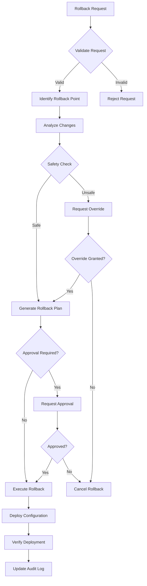

# Configuration Rollback Design

## Overview

This document outlines the design for implementing configuration rollback capabilities in CFGMS. The rollback system integrates with the Git backend to provide reliable, auditable, and safe configuration rollback functionality.

## Goals

1. **Reliable Rollback**: Ensure configurations can be safely rolled back to previous versions
2. **Audit Trail**: Maintain complete audit trail of all rollback operations
3. **Safety Checks**: Implement validation to prevent dangerous rollbacks
4. **Multi-Level Support**: Support rollback at device, group, client, and MSP levels
5. **Integration**: Seamless integration with Git backend and existing module system

## Architecture

### Components

#### 1. Rollback Manager

Central component that orchestrates rollback operations:

- Interfaces with Git backend to retrieve historical configurations
- Validates rollback safety and dependencies
- Coordinates with Steward for configuration deployment
- Maintains rollback audit logs

#### 2. Rollback Validator

Ensures rollback operations are safe:

- Checks for breaking changes between versions
- Validates module compatibility
- Ensures dependencies are satisfied
- Prevents rollback that would cause system instability

#### 3. Rollback API

REST API endpoints for rollback operations:

- List available rollback points
- Preview rollback changes
- Execute rollback with approval workflow
- Monitor rollback progress

#### 4. Rollback Audit Logger

Tracks all rollback operations:

- Who initiated the rollback
- What was rolled back
- When the rollback occurred
- Why the rollback was performed
- Success/failure status

### Rollback Types

1. **Full Configuration Rollback**
   - Rolls back entire configuration to a specific commit
   - Used for disaster recovery scenarios
   - Requires elevated permissions

2. **Partial Configuration Rollback**
   - Rolls back specific configuration files/modules
   - Maintains other configurations at current version
   - Useful for targeted fixes

3. **Module-Level Rollback**
   - Rolls back individual module configurations
   - Preserves module isolation
   - Supports granular control

4. **Emergency Rollback**
   - Immediate rollback without approval workflow
   - Used in critical outage scenarios
   - Requires special permissions and generates alerts

### Rollback Workflow



### Safety Mechanisms

1. **Pre-Rollback Validation**
   - Module compatibility checks
   - Dependency validation
   - Breaking change detection
   - System health verification

2. **Rollback Testing**
   - Dry-run capability
   - Preview of changes
   - Impact analysis
   - Risk assessment

3. **Progressive Rollback**
   - Canary rollback to subset of devices
   - Monitoring during rollback
   - Automatic halt on errors
   - Rollback of rollback capability

4. **Post-Rollback Verification**
   - Configuration validation
   - Health checks
   - Service verification
   - Alert on anomalies

### Integration Points

1. **Git Backend Integration**
   - Retrieve historical configurations
   - Create rollback commits
   - Maintain version history
   - Support branch-based rollbacks

2. **Module System Integration**
   - Module-aware rollback
   - Version compatibility checks
   - State preservation
   - Dependency management

3. **Steward Integration**
   - Deploy rollback configurations
   - Monitor rollback progress
   - Report rollback status
   - Handle rollback failures

4. **Controller Integration**
   - Coordinate multi-device rollbacks
   - Manage rollback approval workflow
   - Monitor rollback health
   - Generate rollback reports

### API Design

#### List Rollback Points

```
GET /api/v1/rollback/points?target_type={device|group|client|msp}&target_id={id}&limit=50

Response:
{
  "rollback_points": [
    {
      "commit_sha": "abc123",
      "timestamp": "2024-07-29T10:00:00Z",
      "author": "john.doe",
      "message": "Update firewall rules",
      "configurations": ["firewall.yaml", "network.yaml"],
      "risk_level": "low",
      "can_rollback": true
    }
  ]
}
```

#### Preview Rollback

```
POST /api/v1/rollback/preview

Request:
{
  "target_type": "device",
  "target_id": "device-123",
  "rollback_to": "abc123",
  "rollback_type": "full"
}

Response:
{
  "preview": {
    "changes": [
      {
        "path": "firewall.yaml",
        "current_version": "def456",
        "rollback_version": "abc123",
        "diff": "...",
        "risk": "low"
      }
    ],
    "affected_modules": ["firewall", "network"],
    "validation_results": {
      "passed": true,
      "warnings": [],
      "errors": []
    },
    "estimated_duration": "5m",
    "requires_approval": true
  }
}
```

#### Execute Rollback

```
POST /api/v1/rollback/execute

Request:
{
  "target_type": "device",
  "target_id": "device-123",
  "rollback_to": "abc123",
  "rollback_type": "full",
  "reason": "Reverting problematic firewall update",
  "emergency": false,
  "approval_id": "approval-789"
}

Response:
{
  "rollback": {
    "id": "rollback-456",
    "status": "in_progress",
    "started_at": "2024-07-29T10:05:00Z",
    "progress": {
      "stage": "deploying",
      "percentage": 25,
      "current_action": "Updating firewall configuration"
    }
  }
}
```

#### Monitor Rollback

```
GET /api/v1/rollback/{rollback_id}/status

Response:
{
  "rollback": {
    "id": "rollback-456",
    "status": "completed",
    "started_at": "2024-07-29T10:05:00Z",
    "completed_at": "2024-07-29T10:10:00Z",
    "result": "success",
    "configurations_rolled_back": 2,
    "devices_affected": 1,
    "audit_trail": [...]
  }
}
```

### Database Schema

```sql
-- Rollback operations table
CREATE TABLE rollback_operations (
    id UUID PRIMARY KEY,
    target_type VARCHAR(50) NOT NULL,
    target_id VARCHAR(255) NOT NULL,
    rollback_type VARCHAR(50) NOT NULL,
    from_commit VARCHAR(40) NOT NULL,
    to_commit VARCHAR(40) NOT NULL,
    initiated_by VARCHAR(255) NOT NULL,
    initiated_at TIMESTAMP NOT NULL,
    completed_at TIMESTAMP,
    status VARCHAR(50) NOT NULL,
    reason TEXT,
    emergency BOOLEAN DEFAULT FALSE,
    approval_id VARCHAR(255),
    metadata JSONB,
    created_at TIMESTAMP DEFAULT NOW(),
    updated_at TIMESTAMP DEFAULT NOW()
);

-- Rollback audit log
CREATE TABLE rollback_audit_log (
    id UUID PRIMARY KEY,
    rollback_id UUID REFERENCES rollback_operations(id),
    timestamp TIMESTAMP NOT NULL,
    event_type VARCHAR(50) NOT NULL,
    actor VARCHAR(255) NOT NULL,
    details JSONB,
    created_at TIMESTAMP DEFAULT NOW()
);

-- Rollback validation results
CREATE TABLE rollback_validations (
    id UUID PRIMARY KEY,
    rollback_id UUID REFERENCES rollback_operations(id),
    validation_type VARCHAR(50) NOT NULL,
    result VARCHAR(50) NOT NULL,
    details JSONB,
    created_at TIMESTAMP DEFAULT NOW()
);
```

### Error Handling

1. **Rollback Failures**
   - Automatic retry with exponential backoff
   - Fallback to previous stable configuration
   - Alert generation for manual intervention
   - Detailed error logging

2. **Partial Rollback Success**
   - Track which components succeeded/failed
   - Option to continue or abort
   - Detailed status reporting
   - Recovery procedures

3. **Network Failures**
   - Resilient to intermittent connectivity
   - Resume capability
   - Local rollback caching
   - Eventual consistency

### Security Considerations

1. **Permission Model**
   - Role-based access control
   - Granular permissions per rollback type
   - Audit of permission usage
   - Emergency override controls

2. **Approval Workflow**
   - Multi-level approval for critical rollbacks
   - Time-limited approval validity
   - Audit trail of approvals
   - Notification system

3. **Data Protection**
   - Encryption of rollback data in transit
   - Secure storage of historical configurations
   - Protection of sensitive configuration data
   - Compliance with data retention policies

### Performance Considerations

1. **Efficient History Retrieval**
   - Indexed Git operations
   - Caching of recent configurations
   - Pagination of rollback points
   - Optimized diff generation

2. **Scalable Rollback Execution**
   - Parallel rollback for multiple devices
   - Batched operations
   - Progress tracking
   - Resource throttling

3. **Minimal Downtime**
   - Rolling rollback strategy
   - Pre-staged configurations
   - Quick failover
   - Health check optimization

### Testing Strategy

1. **Unit Tests**
   - Rollback manager logic
   - Validation rules
   - API endpoints
   - Database operations

2. **Integration Tests**
   - Git backend integration
   - Module system interaction
   - Steward communication
   - End-to-end workflows

3. **Performance Tests**
   - Large-scale rollbacks
   - Historical data retrieval
   - Concurrent operations
   - Network resilience

4. **Chaos Testing**
   - Failure injection
   - Network partitions
   - Partial failures
   - Recovery procedures

## Implementation Phases

### Phase 1: Core Rollback (Week 1)

- Implement RollbackManager
- Basic Git integration
- Simple rollback operations
- Unit tests

### Phase 2: Safety & Validation (Week 2)

- Implement RollbackValidator
- Safety checks
- Dependency validation
- Integration tests

### Phase 3: API & UI (Week 3)

- REST API implementation
- Approval workflow
- Progress monitoring
- Documentation

### Phase 4: Advanced Features (Week 4)

- Emergency rollback
- Partial rollback
- Performance optimization
- Chaos testing

## Success Metrics

1. **Reliability**: 99.9% successful rollback rate
2. **Performance**: Rollback initiated within 30 seconds
3. **Safety**: Zero critical failures due to rollback
4. **Auditability**: 100% of rollbacks fully audited
5. **Usability**: 90% of rollbacks require no manual intervention
