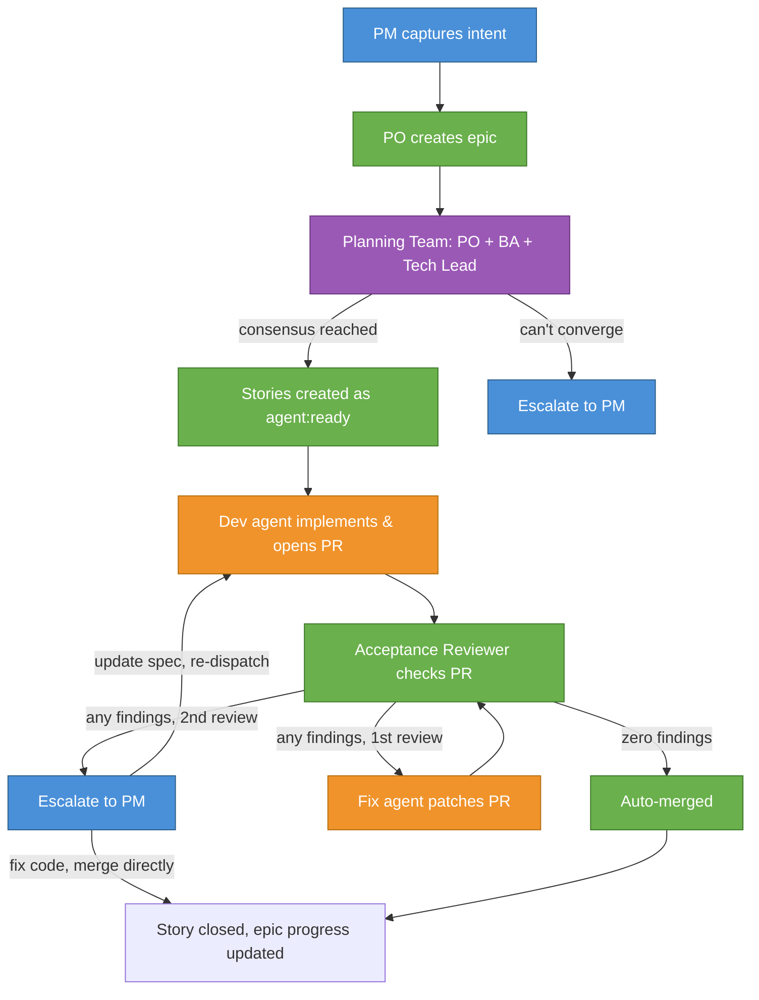
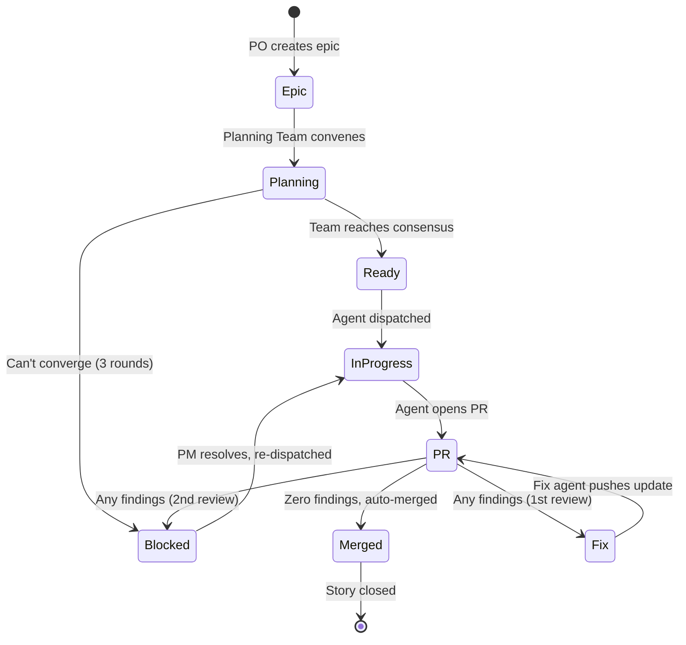
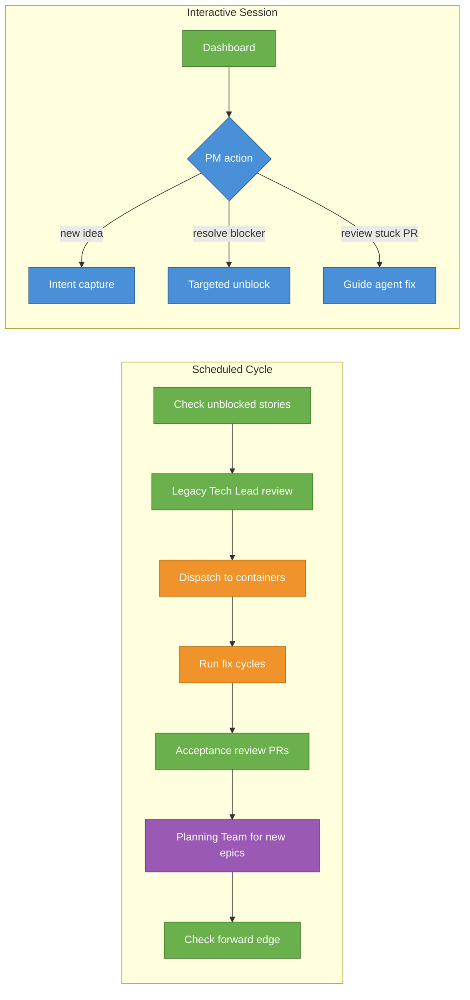

# Autonomous Development Team

How ideas become tested, reviewed, merged code — with humans operating at the PM level.

## The Team

The autonomous development pipeline mirrors a standard product delivery org. Human operators focus on product direction, unblocking, and merge decisions. AI agents handle everything downstream — decomposition, implementation, review, and fix cycles. Operators only step into code-level work when an agent gets stuck or needs domain-specific guidance.

| Role | Who | Responsibility |
|------|-----|----------------|
| **Product Manager** | Human operator | Vision, intent, unblocking agents when they get stuck |
| **Product Owner** | Claude Code session | Pipeline orchestration, dashboard, intent capture, planning team lead |
| **Business Analyst** | Planning Team member | Proposes story decomposition, defends scope decisions, revises based on Tech Lead feedback |
| **Tech Lead** | Planning Team member | Validates story proposals for dev agent executability, challenges BA on scope and feasibility |
| **Developer** | Containerized agent | Implements code in isolated Docker containers, opens PR |
| **Acceptance Reviewer** | PO-spawned subagent | Reviews PRs against acceptance criteria, auto-merges clean PRs |
| **QA Reviewer** | PO-spawned subagent | Code quality, test correctness (manual review path) |
| **Security Engineer** | PO-spawned subagent | Vulnerability scanning, architecture compliance (manual review path) |

Multiple human operators can work in parallel — each owns one or more epics, and `pipeline:blocked` items route to the correct person via GitHub assignee.

## Pipeline Flow

> **Legend:** 🔵 Human operator | 🟢 Agent (subagent) | 🟠 Agent (isolated container) | 🟣 Agent team (collaborative)

## How It Works

### 1. Intent Capture

A PM describes what they want built in conversation with the Product Owner. The PO pushes for specificity — outcome-based goals, testable success criteria, explicit non-goals. Vague ideas get refined before anything is written.

The PO creates a GitHub **epic issue** with the structured intent.

### 2. Collaborative Planning (Planning Team)

The PO creates a temporary **Planning Team** — spawning the BA and Tech Lead as teammates who collaborate in real time via `SendMessage`.

The **Business Analyst** surveys the codebase and proposes story decompositions. The **Tech Lead** validates each proposal against the codebase — checking dependency ordering, file references, scope, constraints, and ambiguity. The **PO** mediates, makes product decisions when the BA and Tech Lead disagree, and breaks ties.

The conversation iterates (max 3 rounds) until all stories are agreed upon:
- BA proposes stories → Tech Lead reviews → feedback/revision → repeat
- BA and Tech Lead can challenge each other directly
- PO makes product calls when they disagree on scope or priority

Once consensus is reached, the PO creates all stories on GitHub as sub-issues with `agent:ready` labels — they skip the draft phase entirely since the Tech Lead already validated them during the planning conversation. Each story includes:

- Specific files in scope
- Reference implementations to follow
- Testable acceptance criteria
- Dependency ordering
- Implementation notes (added by Tech Lead during review)

### 3. Development

Each story is dispatched to an isolated **Docker container** running Claude Code. The dev agent:

- Checks out a fresh branch from `develop`
- Reads the story spec
- Writes tests first (TDD)
- Implements using real components (no mocks)
- Runs the full validation suite
- Opens a PR against `develop`

Agents run in parallel — multiple stories can be in flight simultaneously.

### 4. Acceptance Review

The **Acceptance Reviewer** checks each PR against the story's acceptance criteria, CI status, and code quality. The outcome is fully automated:

- **Zero findings**: PR is **auto-merged**, agent container and clone cleaned up — no human involvement needed
- **Any findings (1st review)**: A **fix agent** is dispatched in a container to address the findings
- **Any findings (2nd review)**: **Escalated to PM** as a `pipeline:blocked` item, agent container and clone cleaned up — the agent team couldn't resolve it

The PM only sees PRs that agents failed to get right after two attempts. For those, the PM provides guidance (updated story spec, clarification, or direct code fix) and the cycle restarts.

#### FIFO Review Order

When multiple PRs are ready for acceptance review simultaneously, the PO processes them in **FIFO order** (oldest PR first, by `createdAt` timestamp ascending). This policy minimizes rebase churn:

- The oldest PR was based on the earliest develop snapshot and has the fewest accumulated conflicts.
- Once it merges, the next-oldest PR only needs to rebase against one new commit, not an arbitrary set.
- Reviewing in arbitrary or reverse order causes a cascade: PR-B merges first → PR-A needs rebase against PR-B → PR-C also needs rebase → churn compounds.

PRs are processed **serially** — one acceptance reviewer at a time — so that each subsequent review is against an up-to-date develop tip. A PR held due to a file conflict gate does **not** block strictly-younger PRs that don't share the conflicting files; those skip ahead in the queue.

This policy was adopted after PRs #770–772 and #777 landed out-of-order in close succession, leaving #777 stale by 4 merges and triggering hotfix #785.

### 5. Completion

Merged PRs auto-close their story issues. The PO tracks epic completion via GitHub sub-issue progress and surfaces the next action.

### Container Cleanup

Agent containers and their clones are cleaned up automatically:

- **On auto-merge** — Acceptance Reviewer removes the container and clone immediately
- **On escalation** — Acceptance Reviewer cleans up when applying `pipeline:blocked` (2nd review failure)
- **PO cron sweep** — each cycle runs `agent-dispatch.sh cleanup-stale` before dispatch, removing containers whose stories are closed, `agent:failed`, or `pipeline:blocked`

Failed or stale containers are preserved until the PO cron sweep runs or the story is re-dispatched, so logs and results remain available for debugging.

## Pipeline State Machine

All coordination happens through GitHub labels — no external state store.

| Label | Stage |
|-------|-------|
| `pipeline:epic` | Epic defined, awaiting Planning Team |
| `pipeline:story` | Story sub-issue of an epic (applied to all stories) |
| `agent:ready` | Story validated by Planning Team, queued for dispatch |
| `agent:in-progress` | Dev agent container running |
| `pipeline:fix` | PR has findings, fix agent dispatched |
| `pipeline:blocked` | Escalation — agents couldn't resolve, needs human input |
| `pipeline:draft` | (Legacy) Story awaiting standalone Tech Lead review |

## Orchestration

The Product Owner operates in two modes:

**Interactive** — when a PM is present. Shows a prioritized dashboard, captures new intent, processes targeted unblocks. The primary human interface to the pipeline.

**Scheduled** — runs autonomously on a timer. Executes the full pipeline cycle: decomposition, tech lead review, dispatch, fix cycles, acceptance review. Creates `pipeline:blocked` issues for anything it can't resolve.

## Design Principles

**GitHub is the single source of truth.** All pipeline state lives in GitHub issues, labels, and PRs. No local files, no external databases. Any team member can check status from their phone.

**Agents don't guess.** Stories must be self-contained with explicit file references and testable criteria. The Planning Team debates and resolves ambiguity before stories are created — vague proposals get challenged by the Tech Lead and refined by the BA before any dev agent sees them.

**One escalation surface.** Every blocker becomes a `pipeline:blocked` issue assigned to the responsible person. No Slack messages, no email, no notifications outside GitHub.

**Autonomous fix before escalation.** When a PR fails review, the system attempts one automated fix cycle before involving a human.

**No mocks, no shortcuts.** Dev agents use real components, run real tests, and pass real CI. The same validation gates apply to human and agent code.

**Humans operate at the PM level.** The pipeline is designed so that human operators spend their time on product direction, intent capture, and resolving ambiguities — not writing code. When an agent gets stuck, the human provides guidance and the agent retries. Direct code intervention is the exception, not the workflow.

## Further Reading

- [Agent Dispatch Reference](agent-dispatch.md) — container infrastructure, credentials, troubleshooting
- [Autonomous Agent System PRD](../product/autonomous-agent-system-prd.md) — full product requirements
- [PR Review Methodology](pr-review-methodology.md) — how code review works
