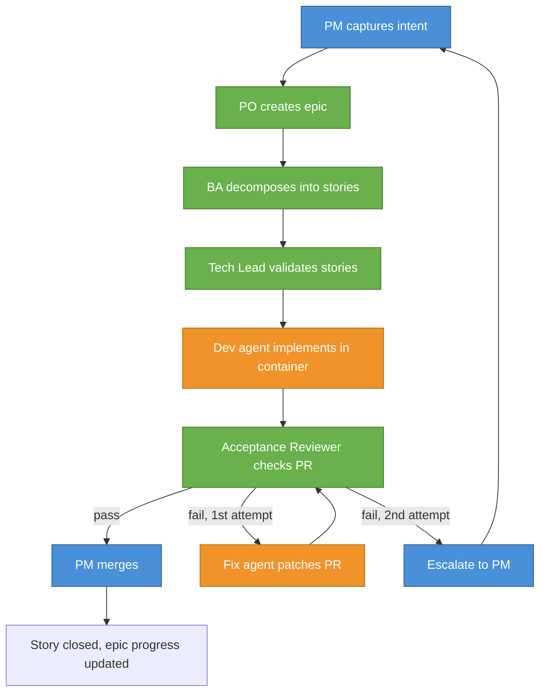
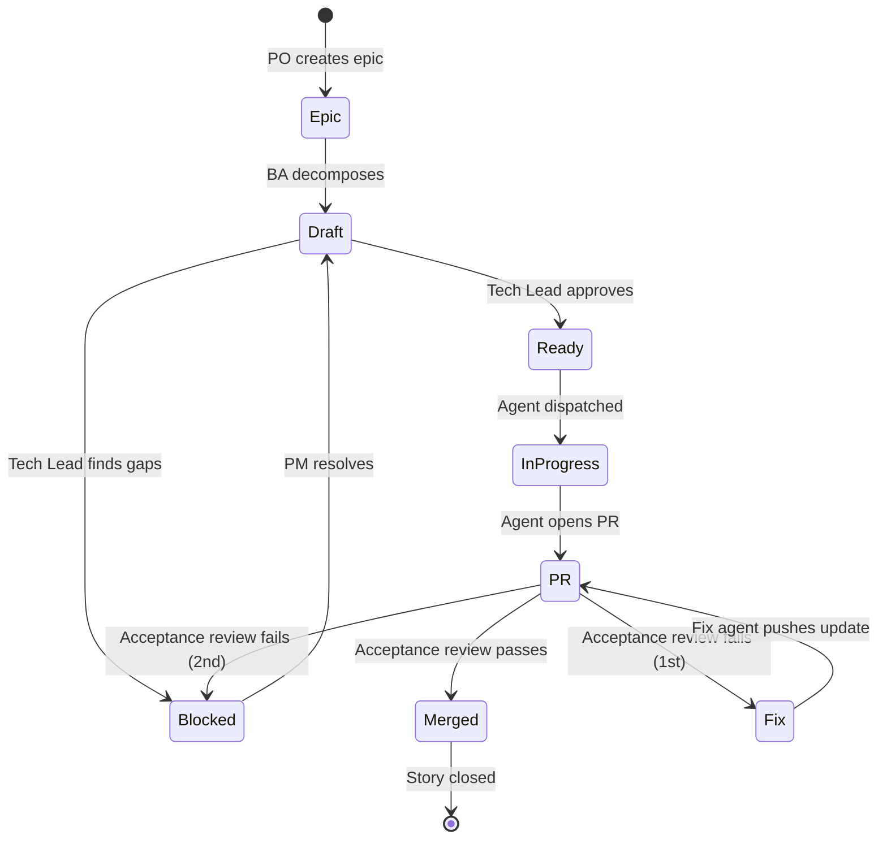
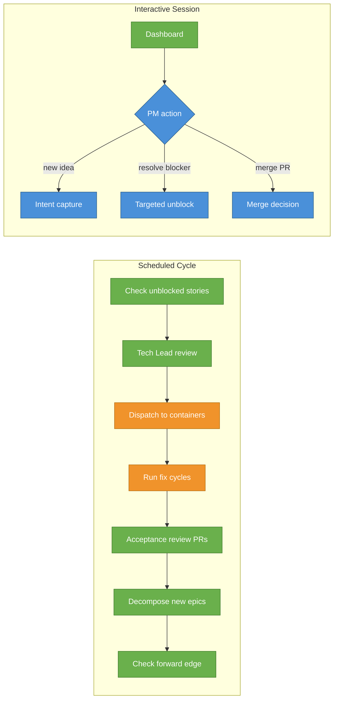

# Autonomous Development Team

How ideas become tested, reviewed, merged code — with humans operating at the PM level.

## The Team

The autonomous development pipeline mirrors a standard product delivery org. Human operators focus on product direction, unblocking, and merge decisions. AI agents handle everything downstream — decomposition, implementation, review, and fix cycles. Operators only step into code-level work when an agent gets stuck or needs domain-specific guidance.

| Role | Who | Responsibility |
|------|-----|----------------|
| **Product Manager** | Human operator | Vision, intent, merge decisions, unblocking agents |
| **Product Owner** | Claude Code session | Pipeline orchestration, dashboard, intent capture |
| **Business Analyst** | PO-spawned subagent | Decomposes epics into implementable stories |
| **Tech Lead** | PO-spawned subagent | Validates stories for agent executability |
| **Developer** | Containerized agent | Implements code in isolated Docker containers |
| **Acceptance Reviewer** | PO-spawned subagent | Reviews PRs against acceptance criteria |
| **QA Reviewer** | PO-spawned subagent | Code quality, test correctness |
| **Security Engineer** | PO-spawned subagent | Vulnerability scanning, architecture compliance |

Multiple human operators can work in parallel — each owns one or more epics, and `pipeline:blocked` items route to the correct person via GitHub assignee.

## Pipeline Flow

> **Legend:** 🔵 Human operator | 🟢 Agent (subagent) | 🟠 Agent (isolated container)

## How It Works

### 1. Intent Capture

A PM describes what they want built in conversation with the Product Owner. The PO pushes for specificity — outcome-based goals, testable success criteria, explicit non-goals. Vague ideas get refined before anything is written.

The PO creates a GitHub **epic issue** with the structured intent.

### 2. Story Decomposition

The **Business Analyst** agent reads the epic, surveys the codebase, and breaks it into implementable stories. Each story is a GitHub sub-issue with:

- Specific files in scope
- Reference implementations to follow
- Testable acceptance criteria
- Dependency ordering

### 3. Tech Lead Review

The **Tech Lead** agent validates each story for dev agent executability. It checks dependency ordering, verifies file references against current code, removes ambiguity, and adds implementation notes. Stories that pass are promoted to the dispatch queue. Stories with gaps get flagged.

### 4. Development

Each story is dispatched to an isolated **Docker container** running Claude Code. The dev agent:

- Checks out a fresh branch from `develop`
- Reads the story spec
- Writes tests first (TDD)
- Implements using real components (no mocks)
- Runs the full validation suite
- Opens a PR against `develop`

Agents run in parallel — multiple stories can be in flight simultaneously.

### 5. Review

The **Acceptance Reviewer** checks each PR against the story's acceptance criteria and CI status. If everything passes, the PR is auto-merged. If there are findings, the PR enters a fix cycle:

- **First failure**: A fix agent is dispatched to address the review findings
- **Second failure**: Escalated to the responsible PM as a blocked item

For blocked PRs, **QA** and **Security** specialist agents provide additional review context to help the human resolve the issue.

### 6. Merge & Completion

Merged PRs auto-close their story issues. The PO tracks epic completion via GitHub sub-issue progress and surfaces the next action.

## Pipeline State Machine

All coordination happens through GitHub labels — no external state store.

| Label | Stage |
|-------|-------|
| `pipeline:epic` | Epic defined, awaiting decomposition |
| `pipeline:draft` | Story written, awaiting Tech Lead review |
| `agent:ready` | Story validated, queued for dispatch |
| `agent:in-progress` | Dev agent container running |
| `pipeline:fix` | PR failed review, fix agent dispatched |
| `pipeline:review` | PR passed review, awaiting merge |
| `pipeline:blocked` | Escalation — needs human input |

## Orchestration

The Product Owner operates in two modes:

**Interactive** — when a PM is present. Shows a prioritized dashboard, captures new intent, processes targeted unblocks. The primary human interface to the pipeline.

**Scheduled** — runs autonomously on a timer. Executes the full pipeline cycle: decomposition, tech lead review, dispatch, fix cycles, acceptance review. Creates `pipeline:blocked` issues for anything it can't resolve.

## Design Principles

**GitHub is the single source of truth.** All pipeline state lives in GitHub issues, labels, and PRs. No local files, no external databases. Any team member can check status from their phone.

**Agents don't guess.** Stories must be self-contained with explicit file references and testable criteria. Vague specs get rejected by the Tech Lead, not interpreted by the dev agent.

**One escalation surface.** Every blocker becomes a `pipeline:blocked` issue assigned to the responsible person. No Slack messages, no email, no notifications outside GitHub.

**Autonomous fix before escalation.** When a PR fails review, the system attempts one automated fix cycle before involving a human.

**No mocks, no shortcuts.** Dev agents use real components, run real tests, and pass real CI. The same validation gates apply to human and agent code.

**Humans operate at the PM level.** The pipeline is designed so that human operators spend their time on product direction, intent capture, and resolving ambiguities — not writing code. When an agent gets stuck, the human provides guidance and the agent retries. Direct code intervention is the exception, not the workflow.

## Further Reading

- [Agent Dispatch Reference](agent-dispatch.md) — container infrastructure, credentials, troubleshooting
- [Autonomous Agent System PRD](../product/autonomous-agent-system-prd.md) — full product requirements
- [PR Review Methodology](pr-review-methodology.md) — how code review works
