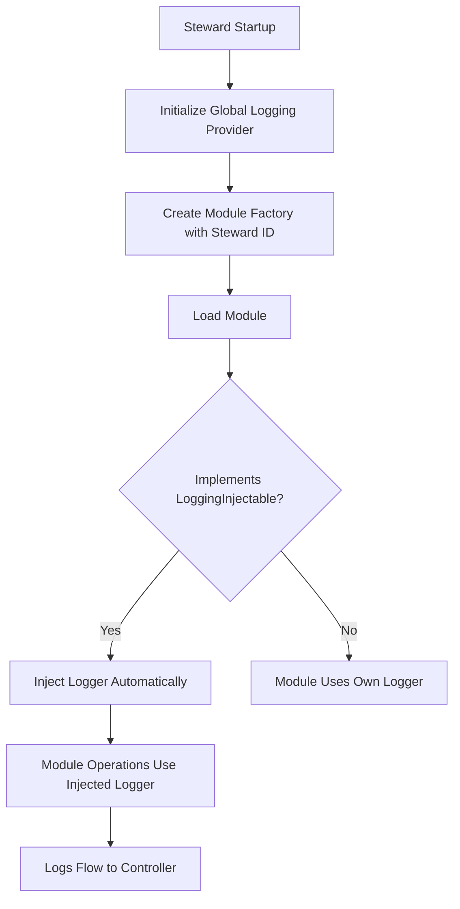

# CFGMS Module Logging Dependency Injection Guide

This guide explains how to implement dependency injection for logging in CFGMS modules, enabling central visibility and structured logging while maintaining security compatibility.

## Overview

CFGMS uses interface-based dependency injection to provide centralized logging to modules. This approach:

- **Preserves Binary Signatures**: No code modification or runtime patching
- **Maintains EDR Compatibility**: Uses standard Go interfaces, no suspicious patterns
- **Enables Central Visibility**: Controller receives all steward activity logs
- **Supports Tenant Isolation**: Automatic context-based tenant extraction

## Architecture

### Core Interfaces

**`LoggingInjectable`** - Modules implement this to receive logger injection:

```go
type LoggingInjectable interface {
    InjectLogger(logger Logger) error
    GetEffectiveLogger(fallback Logger) Logger
}
```

**`LoggerProvider`** - Factory provides loggers to modules:

```go
type LoggerProvider interface {
    GetLoggerForModule(moduleName string) Logger
}
```

**`DefaultLoggingSupport`** - Embeddable struct providing injection capability:

```go
type DefaultLoggingSupport struct {
    injectedLogger Logger
    mu             sync.RWMutex
}
```

### Injection Flow



## Implementation Guide

### Step 1: Add Injection Support to Module

Embed `DefaultLoggingSupport` in your module struct:

```go
package mymodule

import (
    "context"
    "github.com/cfg-is/cfgms/features/modules"
    "github.com/cfg-is/cfgms/pkg/logging"
)

type Module struct {
    // Embed for automatic injection capability
    modules.DefaultLoggingSupport

    // Module-specific fields
    config *Config
    state  *State
}

func New(config *Config) modules.Module {
    return &Module{
        config: config,
    }
}
```

### Step 2: Use Injected Logger in Operations

Use `GetEffectiveLogger()` to get either the injected logger or a fallback:

```go
func (m *Module) Set(ctx context.Context, resourceID string, config modules.ConfigState) error {
    // Get effective logger (injected or fallback)
    logger := m.GetEffectiveLogger(logging.ForModule("mymodule"))

    logger.InfoCtx(ctx, "Starting operation",
        "operation", "mymodule_set",
        "resource_id", resourceID,
        "tenant_id", logging.ExtractTenantFromContext(ctx))

    // Perform operation...
    if err := m.performOperation(ctx, resourceID, config); err != nil {
        logger.ErrorCtx(ctx, "Operation failed",
            "operation", "mymodule_set",
            "resource_id", resourceID,
            "error_code", "OPERATION_FAILED",
            "error", err.Error())
        return err
    }

    logger.InfoCtx(ctx, "Operation completed",
        "operation", "mymodule_set",
        "resource_id", resourceID,
        "duration_ms", elapsed.Milliseconds())

    return nil
}
```

### Step 3: Add Structured Logging Fields

**Required fields for all log entries:**

- `operation`: High-level operation name (e.g., "mymodule_set", "mymodule_get")
- `resource_id`: Resource being operated on
- `tenant_id`: Extracted from context using `logging.ExtractTenantFromContext(ctx)`

**Additional fields for ERROR level:**

- `error_code`: Standardized error code (e.g., "OPERATION_FAILED", "VALIDATION_ERROR")
- `error`: Error message from the error object

**Additional fields for INFO level:**

- `duration_ms`: Operation duration in milliseconds
- `resource_count`: Number of resources affected (if applicable)

### Step 4: Handle Different Log Levels

```go
// DEBUG - Detailed debugging information (use sparingly in production)
logger.DebugCtx(ctx, "Processing configuration",
    "operation", "mymodule_validate",
    "config_size", len(configData))

// INFO - Operational events
logger.InfoCtx(ctx, "Configuration applied",
    "operation", "mymodule_apply",
    "resource_id", resourceID,
    "duration_ms", elapsed.Milliseconds())

// WARN - Non-fatal issues that should be investigated
logger.WarnCtx(ctx, "Retry attempt",
    "operation", "mymodule_connect",
    "resource_id", resourceID,
    "attempt", retryCount,
    "max_attempts", maxRetries)

// ERROR - Fatal errors requiring attention
logger.ErrorCtx(ctx, "Operation failed",
    "operation", "mymodule_execute",
    "resource_id", resourceID,
    "error_code", "EXECUTION_FAILED",
    "error", err.Error())
```

## Factory Integration

### How Factory Injects Loggers

The module factory automatically injects loggers when loading modules:

```go
// In steward initialization
stewardID := cfg.Steward.ID
factory := factory.NewWithStewardID(registry, cfg.Steward.ErrorHandling, stewardID)

// When loading a module
module, err := factory.LoadModule("mymodule")
// Logger is automatically injected if module implements LoggingInjectable
```

### Monitoring Injection Status

The factory tracks which modules have logger injection:

```go
// Get injection status for all modules
statuses := factory.ListModulesWithLoggers()
for moduleName, status := range statuses {
    fmt.Printf("Module %s: injected=%v, logger=%v\n",
        moduleName, status.Injected, status.Logger != nil)
}
```

## Security Considerations

### Why Interface-Based Injection?

**Code Signature Preservation:**

- No binary modification or runtime patching
- Module constructors remain unchanged
- Binary hashes stay consistent for application allowlisting

**EDR Compatibility:**

- Uses standard Go interfaces (no reflection or dynamic code generation)
- No process injection or memory manipulation
- No suspicious runtime behavior patterns

**Tenant Isolation:**

- Context-based tenant extraction
- No cross-tenant information leakage
- Automatic tenant ID inclusion in all logs

### Security Best Practices

**DO:**

- ✅ Always use `*Ctx()` methods with context
- ✅ Extract tenant ID from context: `logging.ExtractTenantFromContext(ctx)`
- ✅ Use `GetEffectiveLogger()` to handle missing injection gracefully
- ✅ Include structured fields for all operations

**DON'T:**

- ❌ Directly modify module binaries or executable code
- ❌ Store logger instances as global variables
- ❌ Log sensitive information (passwords, tokens, PII)
- ❌ Skip context when logging

## Testing Module Logging

### Testing with Injected Logger

```go
func TestModuleWithInjectedLogger(t *testing.T) {
    // Create memory provider for testing
    provider := memory.NewProvider()
    testLogger := logging.NewLoggerWithProvider(provider, "test-component")

    // Create module and inject logger
    module := New(config)
    injectable, ok := module.(modules.LoggingInjectable)
    require.True(t, ok, "Module should implement LoggingInjectable")

    err := injectable.InjectLogger(testLogger)
    require.NoError(t, err)

    // Perform operation that logs
    ctx := logging.WithTenant(context.Background(), "test-tenant")
    err = module.Set(ctx, "resource-1", configState)
    require.NoError(t, err)

    // Verify log entries
    entries := provider.GetEntries()
    assert.Equal(t, 2, len(entries)) // Start + completion
    assert.Equal(t, "mymodule_set", entries[0].Fields["operation"])
    assert.Equal(t, "test-tenant", entries[0].Fields["tenant_id"])
}
```

### Testing Fallback Behavior

```go
func TestModuleWithoutInjection(t *testing.T) {
    // Create module without injecting logger
    module := New(config)

    // Module should still work with fallback logger
    ctx := context.Background()
    err := module.Set(ctx, "resource-1", configState)
    require.NoError(t, err)
}
```

## Common Patterns

### Request Lifecycle Logging

```go
func (m *Module) ProcessRequest(ctx context.Context, request *Request) error {
    logger := m.GetEffectiveLogger(logging.ForModule("mymodule"))

    // Start of request
    logger.InfoCtx(ctx, "Request received",
        "operation", "mymodule_process",
        "request_id", request.ID,
        "request_type", request.Type)

    // During processing
    logger.DebugCtx(ctx, "Validating request",
        "operation", "mymodule_validate",
        "field_count", len(request.Fields))

    // End of request
    logger.InfoCtx(ctx, "Request completed",
        "operation", "mymodule_process",
        "request_id", request.ID,
        "duration_ms", elapsed.Milliseconds())

    return nil
}
```

### Error Handling with Logging

```go
func (m *Module) PerformOperation(ctx context.Context, resourceID string) error {
    logger := m.GetEffectiveLogger(logging.ForModule("mymodule"))

    result, err := m.executeOperation(ctx, resourceID)
    if err != nil {
        logger.ErrorCtx(ctx, "Operation failed",
            "operation", "mymodule_execute",
            "resource_id", resourceID,
            "error_code", "EXECUTION_FAILED",
            "error", err.Error())
        return fmt.Errorf("operation failed: %w", err)
    }

    logger.InfoCtx(ctx, "Operation completed",
        "operation", "mymodule_execute",
        "resource_id", resourceID,
        "result_size", len(result))

    return nil
}
```

### Retry Logic with Logging

```go
func (m *Module) RetryableOperation(ctx context.Context, resourceID string) error {
    logger := m.GetEffectiveLogger(logging.ForModule("mymodule"))

    maxRetries := 3
    for attempt := 1; attempt <= maxRetries; attempt++ {
        err := m.attemptOperation(ctx, resourceID)
        if err == nil {
            logger.InfoCtx(ctx, "Operation succeeded",
                "operation", "mymodule_retry",
                "resource_id", resourceID,
                "attempt", attempt)
            return nil
        }

        if attempt < maxRetries {
            logger.WarnCtx(ctx, "Retry attempt failed",
                "operation", "mymodule_retry",
                "resource_id", resourceID,
                "attempt", attempt,
                "max_attempts", maxRetries,
                "error", err.Error())
            time.Sleep(time.Second * time.Duration(attempt))
            continue
        }

        logger.ErrorCtx(ctx, "All retry attempts failed",
            "operation", "mymodule_retry",
            "resource_id", resourceID,
            "error_code", "MAX_RETRIES_EXCEEDED",
            "attempts", maxRetries,
            "error", err.Error())
        return fmt.Errorf("operation failed after %d attempts: %w", maxRetries, err)
    }

    return nil
}
```

## Migration Checklist

When adding logging injection to an existing module:

- [ ] Embed `modules.DefaultLoggingSupport` in module struct
- [ ] Update all operations to use `GetEffectiveLogger()`
- [ ] Add structured logging fields (operation, resource_id, tenant_id)
- [ ] Use context-aware logging methods (`*Ctx()`)
- [ ] Extract tenant from context: `logging.ExtractTenantFromContext(ctx)`
- [ ] Add error codes for ERROR level logs
- [ ] Write tests verifying log output
- [ ] Test both injected and fallback logger scenarios
- [ ] Update module documentation

## Related Documentation

- [Logging Architecture Guide](logging-architecture-guide.md) - Overall logging system architecture
- [Logging Migration Standards](logging-migration-standards.md) - Standards for migrating to centralized logging
- [Module Logging Development Guide](module-logging-development-guide.md) - Detailed module-specific guidance

## Examples from Core Modules

### Directory Module

```go
type directoryModule struct {
    modules.DefaultLoggingSupport
    config *DirectoryConfig
}

func (m *directoryModule) Set(ctx context.Context, resourceID string, config modules.ConfigState) error {
    logger := m.GetEffectiveLogger(logging.ForModule("directory"))

    logger.InfoCtx(ctx, "Creating directory",
        "operation", "directory_create",
        "resource_id", resourceID,
        "path", config.Get("path"))

    // Implementation...
}
```

### File Module

```go
type fileModule struct {
    modules.DefaultLoggingSupport
    platform string
}

func (m *fileModule) Set(ctx context.Context, resourceID string, config modules.ConfigState) error {
    logger := m.GetEffectiveLogger(logging.ForModule("file"))

    logger.InfoCtx(ctx, "Writing file",
        "operation", "file_write",
        "resource_id", resourceID,
        "path", config.Get("path"),
        "platform", m.platform)

    // Implementation...
}
```

### Script Module

```go
type scriptModule struct {
    modules.DefaultLoggingSupport
    config *ScriptConfig
}

func (m *scriptModule) Execute(ctx context.Context, resourceID string, script string) error {
    logger := m.GetEffectiveLogger(logging.ForModule("script"))

    logger.InfoCtx(ctx, "Executing script",
        "operation", "script_execute",
        "resource_id", resourceID,
        "script_hash", hash(script))

    // Implementation...
}
```

---

## Version Information

- **Document Version**: 1.0
- **Last Updated**: 2025-11-06
- **Status**: Active
- **Part of**: Story #228 - Documentation Cleanup & Creation
