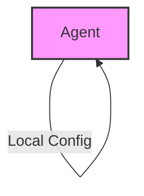
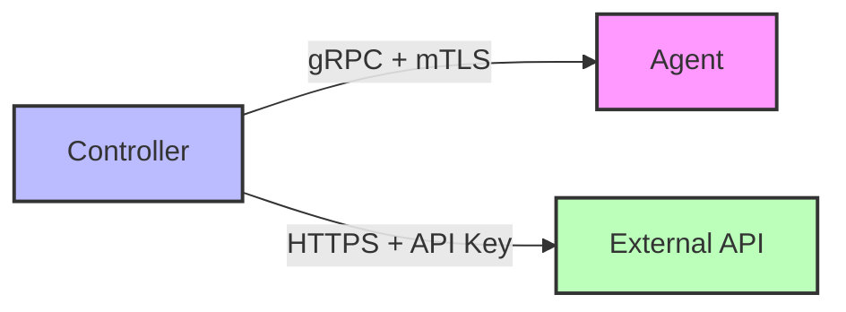
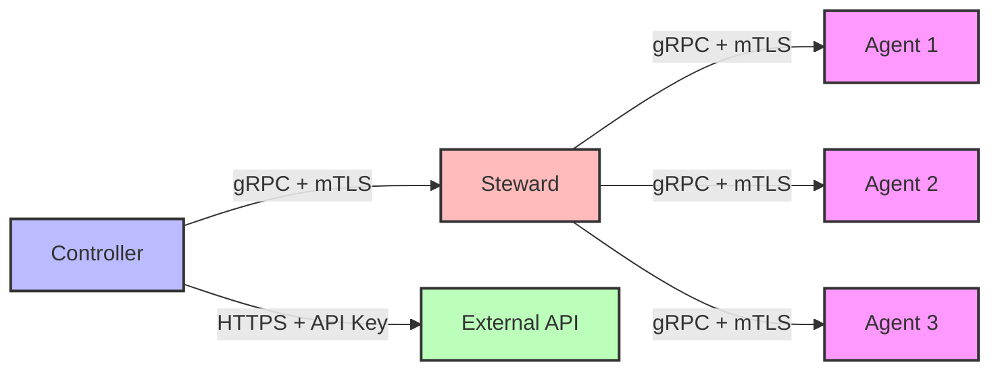

# Security Architecture

## Overview

CFGMS implements a robust security architecture designed to protect both internal communications and external access while maintaining usability and flexibility. This document outlines the security architecture, implementation details, and best practices.

## Communication Flows

### Basic Deployment (Agent-Only)
In the most basic deployment, a single agent operates independently with local configuration:



### Typical Deployment (Controller-Agent)
Standard deployment with direct communication between Controller and Agent:



### Large Environment (Controller-Steward-Agent)
Large deployments with Steward acting as a local proxy-cache:



### Security Considerations for Each Flow

#### Basic Deployment
- Local configuration security
- File system permissions
- Local authentication
- Offline operation security

#### Typical Deployment
- End-to-end encryption
- Certificate management
- API key security
- Network security

#### Large Environment
- Steward authentication
- Cache security
- WAN optimization
- Local network security

## Communication Security

### Internal Communication
- gRPC with mTLS for all internal communication
- Certificate-based authentication
- Strong encryption for all traffic
- Rate limiting and DoS protection

### External Access
- HTTPS with API keys for REST API
- Role-based access control (RBAC)
- API key rotation and management
- Rate limiting and DoS protection

### Optional OpenZiti Integration
- Zero-trust networking capabilities
- Enhanced security for complex deployments
- Seamless integration with existing security
- Configuration-driven enablement

For detailed information about our security decisions, see:
- [SDR-001: Removal of Dark Ports Requirement](decisions/001-remove-dark-ports.md)
- [SDR-002: Dual Protocol Communication Strategy](decisions/002-dual-protocol-communication.md)
- [SDR-003: Optional OpenZiti Integration](decisions/003-optional-openziti.md)

## Authentication & Authorization

### Agent Authentication
- Certificate-based authentication
- Automatic certificate rotation
- Identity verification
- Secure key storage

### API Authentication
- API key management
- Key scoping and permissions
- Rate limiting
- Audit logging

### Role-Based Access Control (RBAC)
- Fine-grained permission system
- Role definitions
- Permission inheritance
- Access audit logging

## Security Best Practices

### Certificate Management
- Automated certificate generation
- Secure key storage
- Regular rotation
- Revocation support

### API Key Management
- Secure key generation
- Key rotation policies
- Usage monitoring
- Revocation procedures

### Logging & Monitoring
- Security event logging
- Audit trail maintenance
- Performance monitoring
- Security alerting

## Deployment Security

### Default Security
- Secure by default configuration
- Minimal attack surface
- Regular security updates
- Dependency management

### Network Security
- TLS 1.3 support
- Strong cipher suites
- Certificate validation
- Connection security

### Data Security
- Encrypted storage
- Secure transmission
- Data sanitization
- Access controls

## Security Considerations

### Development
- Security testing requirements
- Code review guidelines
- Dependency management
- Security documentation

### Deployment
- Security checklist
- Configuration validation
- Monitoring setup
- Incident response

### Implementation Examples

## gRPC with mTLS Configuration

```yaml
# Example agent TLS configuration
tls:
  ca_cert: "/path/to/ca.crt"
  cert: "/path/to/client.crt"
  key: "/path/to/client.key"
  min_version: "TLS1.3"
  cipher_suites:
    - "TLS_AES_256_GCM_SHA384"
    - "TLS_CHACHA20_POLY1305_SHA256"
```

## REST API Security Configuration

```yaml
# Example API security configuration
api:
  rate_limit: 100  # requests per minute
  key_rotation: 30  # days
  allowed_origins:
    - "https://api.example.com"
  cors:
    enabled: true
    max_age: 3600
```

## OpenZiti Integration

```yaml
# Example OpenZiti configuration
ziti:
  enabled: false  # Enable for zero-trust networking
  service_name: "cfgms-agent"
  identity_file: "/path/to/ziti-identity.json"
```

## Troubleshooting

### Common Issues
1. Certificate validation failures
2. API key authentication issues
3. Rate limiting problems
4. TLS handshake failures

### Resolution Steps
1. Verify certificate validity
2. Check API key permissions
3. Review rate limit settings
4. Validate TLS configuration

## Security Checklist

### Deployment
- [ ] Certificates generated and installed
- [ ] API keys created and secured
- [ ] TLS configuration verified
- [ ] Access controls configured
- [ ] Monitoring enabled
- [ ] Logging configured

### Maintenance
- [ ] Certificates up to date
- [ ] API keys rotated
- [ ] Security patches applied
- [ ] Access logs reviewed
- [ ] Security alerts configured
- [ ] Backup procedures verified
