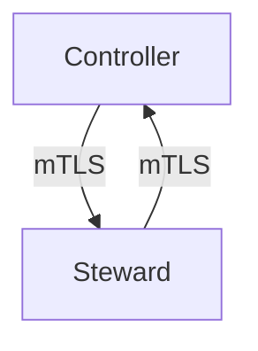
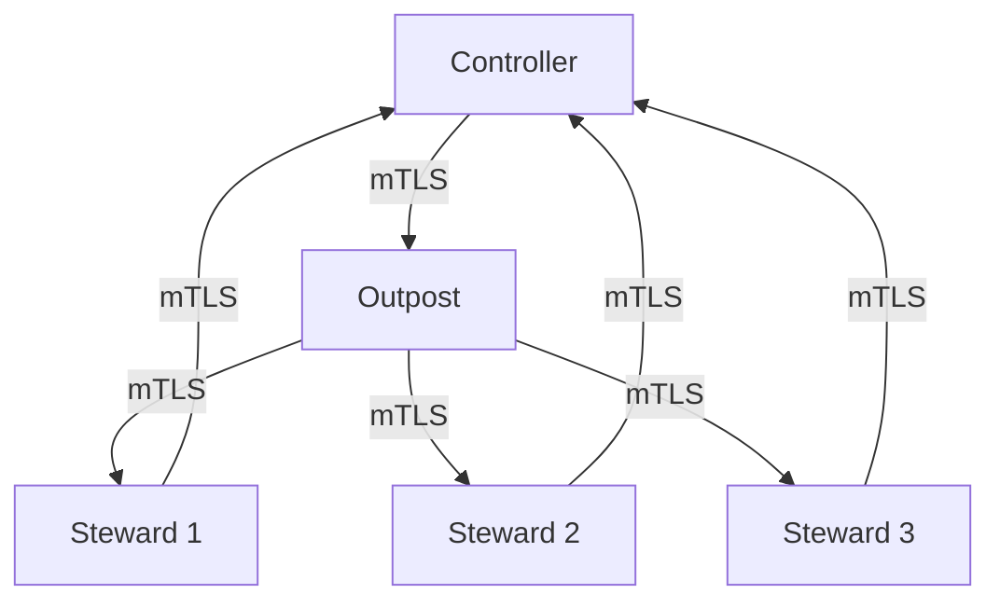
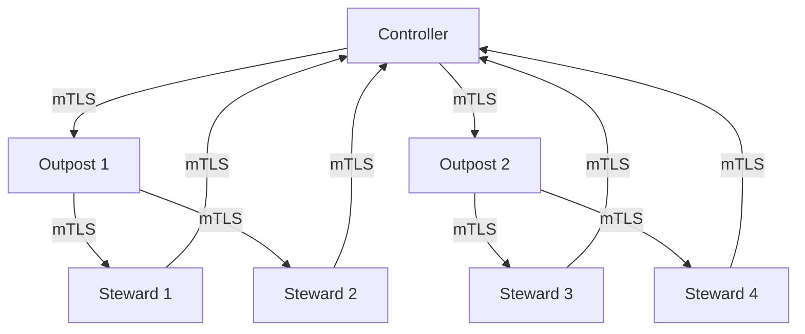

# Security Architecture

This document details the system-wide security architecture for CFGMS, including communication flows, authentication mechanisms, and deployment security considerations.

## Communication Flows

### Basic Deployment


```mermaid
graph TD
    A[Controller] -->|mTLS| B[Steward]
    B -->|mTLS| A
```

### Typical Deployment


```mermaid
graph TD
    A[Controller] -->|mTLS| B[Outpost]
    B -->|mTLS| C[Steward 1]
    B -->|mTLS| D[Steward 2]
    B -->|mTLS| E[Steward 3]
    C -->|mTLS| A
    D -->|mTLS| A
    E -->|mTLS| A
```

### Large Environment


```mermaid
graph TD
    A[Controller] -->|mTLS| B[Outpost 1]
    A -->|mTLS| C[Outpost 2]
    B -->|mTLS| D[Steward 1]
    B -->|mTLS| E[Steward 2]
    C -->|mTLS| F[Steward 3]
    C -->|mTLS| G[Steward 4]
    D -->|mTLS| A
    E -->|mTLS| A
    F -->|mTLS| A
    G -->|mTLS| A
```

## Security Considerations for Each Flow

### Basic Deployment

- Local configuration security
- File system permissions
- Local authentication
- Offline operation security

### Typical Deployment

- Certificate management
- API key security
- Network security

### Large Environment

- Steward authentication
- Cache security
- WAN optimization
- Local network security

## Communication Security

### Internal Communication

- gRPC-over-QUIC protocol with mTLS for all steward-controller communication
  - gRPC control plane for real-time commands, heartbeats, and failover detection
  - gRPC data plane for high-performance configuration and DNA synchronization
- Certificate-based authentication
- Strong encryption for all traffic
- Rate limiting and DoS protection

### External Access

- HTTPS with API keys for REST API
- Role-based access control (RBAC)
- API key rotation and management
- Rate limiting and DoS protection

### Optional OpenZiti Integration

- Zero-trust networking capabilities
- Enhanced security for complex deployments
- Seamless integration with existing security
- Configuration-driven enablement

For detailed information about our security decisions, see:

- [SDR-001: Security Protocol Standardization](decisions/001-remove-dark-ports.md)
- [SDR-002: Dual Protocol Communication Strategy](decisions/002-dual-protocol-communication.md)
- [SDR-003: Optional OpenZiti Integration](decisions/003-optional-openziti.md)

## Authentication & Authorization

### Steward Authentication

- Certificate-based authentication
- Automatic certificate rotation
- Identity verification
- Secure key storage

### API Authentication

- API key management
- Key scoping and permissions
- Rate limiting
- Audit logging

### Web-Admin Credentials (Browser Login)

The controller holds a local web-admin account store that backs the browser
credential login (ADR-018, Addendum 1):

- **Storage:** accounts hold only argon2id PHC hash strings — never the
  cleartext password — persisted through the central `pkg/secrets` provider
  (encrypted at rest, distinct `secret_type: web_account`), with an in-memory
  map as cache only. Accounts survive controller restart. argon2id cost
  parameters are encoded in each stored hash so they can be raised without
  invalidating existing credentials.
- **Provisioning:** Tier-3 only. `POST /api/v1/web/accounts` (create, and
  admin-driven password reset via upsert) and
  `DELETE /api/v1/web/accounts/{username}` require an admin mTLS certificate;
  API-key and session-token callers receive `403 MTLS_REQUIRED`. Every
  create/reset/delete emits an audit event with the sanitized username and the
  acting admin principal; the password value never appears in logs or error
  responses.
- **Scope:** web accounts carry a tenant scope and an allow-listed permission
  set — RBAC-equivalent to API-key principals, never implicit global admins.
- **Verification hardening:** unknown-user and wrong-password failures are
  indistinguishable (uniform error; unknown-user verification runs against a
  dummy argon2id hash for timing uniformity). Passwords are bounded to 8–128
  bytes before hashing; usernames are length- and charset-validated so they
  stay path- and log-safe. Per-account lockout state: 5 consecutive
  verification failures lock the account for 15 minutes (reset on success);
  lockout is enforced at the login endpoint.

**Threat notes:** provisioning is bound to the admin mTLS credential bundle, so
a stolen API key cannot mint or reset web credentials. A compromised admin
session's account changes are fully audited. Hash-only storage bounds the value
of a stolen secret store to offline argon2id cracking of individual passwords.

### Role-Based Access Control (RBAC)

- Fine-grained permission system
- Role definitions
- Permission inheritance
- Access audit logging

### Auth-Tier Policy

The controller REST API assigns every endpoint to one of four authentication tiers. The tier determines what credential strength is required to reach the handler — independently of which permissions the caller holds.

| Tier | Name | Credential requirement |
|------|------|------------------------|
| 0 | Public | No authentication (health check, registration) |
| 1 | Any | Any valid credential: mTLS admin cert **or** API key |
| 2 | Elevated | Reserved for future use |
| 3 | mTLS-Only | mTLS admin certificate required; API keys are rejected even when they carry the exact matching permission |

**Tier-3 discriminator:** The sole check is whether the request carries a valid mTLS admin certificate (`principal.IsAdmin`). The permission set of the caller is never consulted. An API key that holds every Tier-3 permission will still receive HTTP 403 `MTLS_REQUIRED`.

**Tier-3 endpoint surface** (Issue #1419):

| Permission | Endpoint |
|------------|----------|
| `certificate:provision` | `POST /api/v1/certificates/provision` |
| `certificate:rotate` | `POST /api/v1/certificates/signing/rotate` |
| `rbac:create-role` | `POST /api/v1/rbac/roles` |
| `rbac:update-role` | `PUT /api/v1/rbac/roles/{id}` |
| `rbac:delete-role` | `DELETE /api/v1/rbac/roles/{id}` |
| `api-key:create` | `POST /api/v1/api-keys` |
| `api-key:delete` | `DELETE /api/v1/api-keys/{id}` |
| `registration:create-token` | `POST /api/v1/registration/tokens` |
| `registration:delete-token` | `DELETE /api/v1/registration/tokens/{token}` |
| `registration:revoke-token` | `POST /api/v1/registration/tokens/{token}/revoke` |
| `registration:rotate-token` | `POST /api/v1/registration/tokens/{tenant_id}/rotate` |
| `registration:approve` | `POST /api/v1/registration/{id}/approve`, `/approve-all`, `/approve-by-cidr` |
| `registration:manage-ip-trust` | `POST /api/v1/registration/ip-trust`, `DELETE /api/v1/registration/ip-trust/{tenant}/{cidr}` |
| `tenant:create` | `POST /api/v1/tenants` |
| `refresh:approve` | `POST /api/v1/stewards/refresh/{pending_id}/approve` |
| `refresh:set-policy` | `PUT /api/v1/tenants/{tenant_path}/refresh-policy` |
| `web-account:create` | `POST /api/v1/web/accounts` |
| `web-account:delete` | `DELETE /api/v1/web/accounts/{username}` |

The canonical source of truth for this list is `tier3Permissions` in `features/controller/api/auth_tiers.go`. The `TestTier3Enforcement_RouteSetMatchesCanonicalSet` test in `features/controller/api/tier_enforcement_test.go` asserts at test time that the wired route set exactly equals this map — any drift is a test failure.

**Rationale:** Endpoints in this tier can issue credentials, modify trust anchors, or alter the authorization model itself. Restricting them to mTLS provides a hardware-backed authentication guarantee that cannot be replicated by a compromised or stolen API key. Operators who need these capabilities must use an admin credential bundle (mTLS client certificate) rather than an API key.

## Security Best Practices

### Certificate Management

- Automated certificate generation
- Secure key storage
- Regular rotation
- Revocation support

### API Key Management

- Secure key generation
- Key rotation policies
- Usage monitoring
- Revocation procedures

### Logging & Monitoring

- Security event logging
- Audit trail maintenance
- Performance monitoring
- Security alerting

## Deployment Security

### Default Security

- Secure by default configuration
- Minimal attack surface
- Regular security updates
- Dependency management

### Network Security

- TLS 1.3 support
- Strong cipher suites
- Certificate validation
- Connection security

### Data Security

- Encrypted storage
- Secure transmission
- Data sanitization
- Access controls

## Security Considerations

### Development

- Security testing requirements
- Code review guidelines
- Dependency management
- Security documentation

### Deployment

- Security checklist
- Configuration validation
- Monitoring setup
- Incident response

## Implementation Examples

### gRPC-over-QUIC with mTLS Configuration

```yaml
# Example Steward TLS configuration
tls:
  ca_cert: "/path/to/ca.crt"
  cert: "/path/to/client.crt"
  key: "/path/to/client.key"
  min_version: "TLS1.3"
  cipher_suites:
    - "TLS_AES_256_GCM_SHA384"
    - "TLS_CHACHA20_POLY1305_SHA256"

# gRPC-over-QUIC transport configuration
transport:
  server_address: "controller.example.com:4433"
  max_idle_timeout: 60s
  keepalive_period: 30s
  max_streams: 100
```

### REST API Security Configuration

```yaml
# Example API security configuration
api:
  rate_limit: 100  # requests per minute
  key_rotation: 30  # days
  allowed_origins:
    - "https://api.example.com"
  cors:
    enabled: true
    max_age: 3600
```

### OpenZiti Integration

```yaml
# Example OpenZiti configuration
ziti:
  enabled: false  # Enable for zero-trust networking
  service_name: "cfgms-steward"
  identity_file: "/path/to/ziti-identity.json"
```

## Troubleshooting

### Common Issues

1. Certificate validation failures
2. API key authentication issues
3. Rate limiting problems
4. TLS handshake failures

### Resolution Steps

1. Verify certificate validity
2. Check API key permissions
3. Review rate limit settings
4. Validate TLS configuration

## Security Checklist

### Deployment

- [ ] Certificates generated and installed
- [ ] API keys created and secured
- [ ] TLS configuration verified
- [ ] Access controls configured
- [ ] Monitoring enabled
- [ ] Logging configured

### Maintenance

- [ ] Certificates up to date
- [ ] API keys rotated
- [ ] Security patches applied
- [ ] Access logs reviewed
- [ ] Security alerts configured
- [ ] Backup procedures verified

## Related Documentation

For module-specific security requirements, see [Module Security Requirements](../architecture/modules/security.md).
