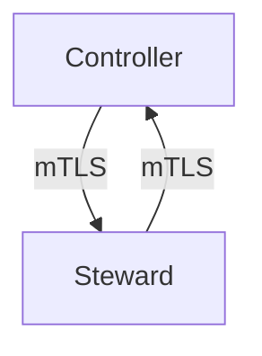
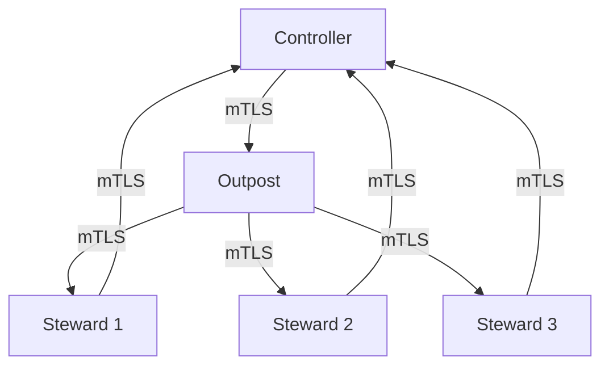
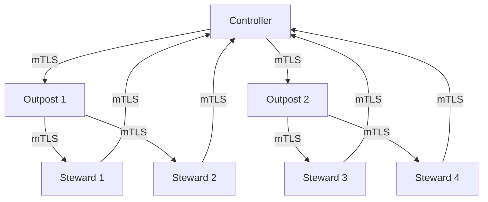

# Security Architecture

This document details the system-wide security architecture for CFGMS, including communication flows, authentication mechanisms, and deployment security considerations.

## Communication Flows

### Basic Deployment


```mermaid
graph TD
    A[Controller] -->|mTLS| B[Steward]
    B -->|mTLS| A
```

### Typical Deployment


```mermaid
graph TD
    A[Controller] -->|mTLS| B[Outpost]
    B -->|mTLS| C[Steward 1]
    B -->|mTLS| D[Steward 2]
    B -->|mTLS| E[Steward 3]
    C -->|mTLS| A
    D -->|mTLS| A
    E -->|mTLS| A
```

### Large Environment


```mermaid
graph TD
    A[Controller] -->|mTLS| B[Outpost 1]
    A -->|mTLS| C[Outpost 2]
    B -->|mTLS| D[Steward 1]
    B -->|mTLS| E[Steward 2]
    C -->|mTLS| F[Steward 3]
    C -->|mTLS| G[Steward 4]
    D -->|mTLS| A
    E -->|mTLS| A
    F -->|mTLS| A
    G -->|mTLS| A
```

## Security Considerations for Each Flow

### Basic Deployment

- Local configuration security
- File system permissions
- Local authentication
- Offline operation security

### Typical Deployment

- Certificate management
- API key security
- Network security

### Large Environment

- Steward authentication
- Cache security
- WAN optimization
- Local network security

## Communication Security

### Internal Communication

- gRPC-over-QUIC protocol with mTLS for all steward-controller communication
  - gRPC control plane for real-time commands, heartbeats, and failover detection
  - gRPC data plane for high-performance configuration and DNA synchronization
- Certificate-based authentication
- Strong encryption for all traffic
- Rate limiting and DoS protection

### External Access

- HTTPS with API keys for REST API
- Role-based access control (RBAC)
- API key rotation and management
- Rate limiting and DoS protection

### Optional OpenZiti Integration

- Zero-trust networking capabilities
- Enhanced security for complex deployments
- Seamless integration with existing security
- Configuration-driven enablement

For detailed information about our security decisions, see:

- [SDR-001: Security Protocol Standardization](decisions/001-remove-dark-ports.md)
- [SDR-002: Dual Protocol Communication Strategy](decisions/002-dual-protocol-communication.md)
- [SDR-003: Optional OpenZiti Integration](decisions/003-optional-openziti.md)

## Authentication & Authorization

### Steward Authentication

- Certificate-based authentication
- Automatic certificate rotation
- Identity verification
- Secure key storage

### API Authentication

- API key management
- Key scoping and permissions
- Rate limiting
- Audit logging

### Web-Admin Credentials (Browser Login)

The controller holds a local web-admin account store that backs the browser
credential login (ADR-018, Addendum 1):

- **Storage:** accounts hold only argon2id PHC hash strings — never the
  cleartext password — persisted through the central `pkg/secrets` provider
  (encrypted at rest, distinct `secret_type: web_account`), with an in-memory
  map as cache only. Accounts survive controller restart. argon2id cost
  parameters are encoded in each stored hash so they can be raised without
  invalidating existing credentials.
- **Provisioning:** AssuranceStrong only (ADR-021). `POST /api/v1/web/accounts` (create, and
  admin-driven password reset via upsert) and
  `DELETE /api/v1/web/accounts/{username}` require an admin mTLS certificate;
  API-key callers receive `403 INSUFFICIENT_PERMISSIONS`; Basic-assurance session callers
  receive `401` with a `WWW-Authenticate: CFGMS-StepUp` challenge. Every
  create/reset/delete emits an audit event with the sanitized username and the
  acting admin principal; the password value never appears in logs or error
  responses.
- **Scope:** web accounts carry a tenant scope and an allow-listed permission
  set — RBAC-equivalent to API-key principals, never implicit global admins.
- **Verification hardening:** unknown-user and wrong-password failures are
  indistinguishable (uniform error; unknown-user verification runs against a
  dummy argon2id hash for timing uniformity). Passwords are bounded to 8–128
  bytes before hashing; usernames are length- and charset-validated so they
  stay path- and log-safe. Per-account lockout state: 5 consecutive
  verification failures lock the account for 15 minutes (reset on success);
  lockout is enforced at the login endpoint.

**Threat notes:** provisioning is bound to the admin mTLS credential bundle, so
a stolen API key cannot mint or reset web credentials. A compromised admin
session's account changes are fully audited. Hash-only storage bounds the value
of a stolen secret store to offline argon2id cracking of individual passwords.

### Web Session Transport (Issue #2492, ADR-018 §1,2)

The controller authenticates browser clients via a `cfgms_session` HttpOnly cookie,
using a **second, web-specific session manager** distinct from the `cfg`-CLI manager:

**Cookie flags (ADR-018 §1):**

```
Set-Cookie: cfgms_session=<token>; HttpOnly; Secure; SameSite=Strict; Path=/
```

- **HttpOnly** — token is unreadable from JavaScript; XSS cannot exfiltrate the session.
- **Secure** — transmitted only over HTTPS.
- **SameSite=Strict** — the primary CSRF defense; the cookie is never sent on cross-site requests.
- **Path=/** — one origin serves both SPA and REST API.

**Lifetimes (ADR-018 §2):**

| Bound | `cfg` CLI (ADR-014) | Web console (ADR-018) |
|-------|---------------------|------------------------|
| Idle timeout | 15 min | 60 min |
| Absolute cap | 8 h | 12 h |
| Grace window | 30 s | 30 s |

Web console tunables are intentionally longer than the `cfg` CLI defaults for operator
comfort during long console sessions. Expiry is server-side and authoritative; the cookie
carries no `Max-Age`. Server-side revocation takes effect immediately.

**Implementation:**

- A **second `session.Manager` instance** (`webSessionManager`) is wired with explicit
  web `session.Config{IdleTimeout: 60m, AbsoluteTimeout: 12h, GraceWindow: 30s}`. The
  first manager (`sessionManager`) retains `DefaultConfig()` (15m/8h/30s) for `cfg` CLI
  use; neither config touches the other.
- Rolling renewal: every authenticated cookie request refreshes `LastActivity` and emits
  a new `Set-Cookie` header with the rotated token. The SPA never sees or handles the
  token value.
- Expired or revoked cookie sessions → `401`; the SPA transitions to the "session expired"
  login screen. No `302` redirects from `/api` paths.

**Credential precedence (security B5.2):**

Any header credential (`Authorization: Bearer`, `X-API-Key`) or admin mTLS identity
**always wins** over the cookie. When a header credential is present, the `cfgms_session`
cookie is ignored entirely — not validated, not renewed, no `Set-Cookie` emitted. This
ensures existing Bearer/API-key/mTLS clients are byte-identical before and after the
cookie branch.

**Visibility note (security A5.7):** web session tokens are not listed via
`GET /api/v1/sessions` or revocable via `DELETE /api/v1/sessions/{id}` — those
endpoints operate on the `cfg`-CLI `sessionManager` only. Web sessions are revoked
server-side via `POST /api/v1/web/logout`.

**CORS note (security A5.8):** the `corsMiddleware` never sets
`Access-Control-Allow-Credentials: true`. Web session cookies are same-origin only;
credentialed cross-origin requests are not supported and must never be enabled.

### Web Login / CSRF / Lockout / Logout (Issue #2493, ADR-018 §3,4)

#### Login flow

```
GET  /api/v1/web/csrf   → Set-Cookie: cfgms_csrf_pre=<token>; Secure; SameSite=Strict; Max-Age=600
POST /api/v1/web/login  (X-CSRF-Token: <token>)
     → Set-Cookie: cfgms_session=...; HttpOnly; Secure; SameSite=Strict; Path=/
     → Set-Cookie: cfgms_csrf=...; Secure; SameSite=Strict; Path=/   (non-HttpOnly)
```

1. **Pre-session CSRF gate (ADR-018 §3):** `GET /api/v1/web/csrf` issues a 32-byte
   `crypto/rand` token in `cfgms_csrf_pre` (Secure; SameSite=Strict; Max-Age=600s).
   The browser echoes it as `X-CSRF-Token` on the login POST. The server compares
   cookie value to header value with `subtle.ConstantTimeCompare`. Mismatch or
   absence → 403 before any credential work.

2. **Session fixation defence:** any valid `cfgms_session` cookie presented with the
   login request is revoked server-side before the new session is issued.

3. **Per-account lockout (ADR-018 §3 / #2490):** 5 consecutive verification failures
   lock the account for 15 minutes. Locked accounts receive the identical uniform 401
   as wrong-password (timing-equalized via dummy argon2id hash). The counter resets on
   a successful login.

4. **Credential verification:** `VerifyWebCredential` — bad user, bad password, and
   malformed input all return the same `ErrInvalidWebCredential` with equivalent latency.

5. **Fresh session:** `webSessionManager.Issue` mints a new token (32 random bytes,
   base64url). The raw token is set in `cfgms_session` (HttpOnly) and never logged.

6. **Session-bound CSRF token:** a second 32-byte `crypto/rand` value is generated,
   stored server-side keyed by session ID, and written to `cfgms_csrf` (non-HttpOnly
   so the SPA can read it and set `X-CSRF-Token` on subsequent mutations).

7. **Response body:** always `{"ok": true}` — no token is ever included (security A5.5).

#### Session-bound CSRF middleware

All **unsafe cookie-authenticated** requests (POST/PUT/PATCH/DELETE on the api subrouter)
pass through `csrfMiddleware` (applied after `authenticationMiddleware`):

- Safe methods (GET, HEAD) are exempt.
- Bearer-token, API-key, and mTLS requests are **never** CSRF-checked — only
  cookie-authenticated requests are in scope.
- The `X-CSRF-Token` header is compared to the server-side session-bound token
  (`subtle.ConstantTimeCompare`). Mismatch or absence → 403.
- Invariant: at any merge point no unsafe cookie-authenticated method is reachable
  without this protection.

The three endpoints on the **base router** (`/api/v1/web/csrf`, `/api/v1/web/login`,
`/api/v1/web/logout`) are explicitly wrapped in `s.authDefense.Middleware` because the
api subrouter middleware chain does not apply to base-router routes (security A5.4).

#### Logout

`POST /api/v1/web/logout` is CSRF-checked (session-bound token required). On success:
- Revokes the server-side session (subsequent cookie use → 401).
- Removes the server-side CSRF token for the session.
- Expires both `cfgms_session` and `cfgms_csrf` cookies (`Max-Age=0`).

#### Audit events

Every login attempt and logout emits a structured `AuditEventAuthentication` event:

| Event | Action | Result |
|-------|--------|--------|
| Login success | `web.login.success` | `success` |
| Login failure (bad credentials) | `web.login.failure` | `failure` |
| Login blocked (account locked) | `web.login.lockout` | `denied` |
| Logout | `web.logout` | `success` |

Audit payloads carry sanitized username, tenant, outcome. Credential material
(passwords, tokens, hashes) is never included. All log lines use
`logging.SanitizeLogValue` for any request-derived field.

### Role-Based Access Control (RBAC)

- Fine-grained permission system
- Role definitions
- Permission inheritance
- Access audit logging

### Auth-Tier Policy

The controller REST API assigns every endpoint to one of four authentication tiers. The tier determines what credential strength is required to reach the handler — independently of which permissions the caller holds.

**Identity assurance levels** (ADR-021, Issue #2780 — replaces the former Tier-3 / `requireTier(TierMTLSOnly)` gate):

| Level | Name | Credential type |
|-------|------|-----------------|
| 0 | Machine | API key |
| 1 | Basic | cfg-CLI Bearer session (ADR-014) or web-session cookie (ADR-018) |
| 2 | Strong | mTLS admin certificate |

Routes that require elevated assurance are declared in `permissionAssurance` (`features/controller/api/assurance.go`). The `requirePermission` middleware enforces the check after authentication: a Machine-assurance principal holding the matching permission receives `403 INSUFFICIENT_PERMISSIONS`; a Basic-assurance principal receives `401` with a `WWW-Authenticate: CFGMS-StepUp realm="cfgms", required="strong"` challenge.

**Strong-assurance endpoint surface** (`permissionAssurance` registry, `Min: AssuranceStrong`):

| Permission | Endpoint |
|------------|----------|
| `certificate:provision` | `POST /api/v1/certificates/provision` |
| `certificate:rotate` | `POST /api/v1/certificates/signing/rotate` |
| `rbac:create-role` | `POST /api/v1/rbac/roles` |
| `rbac:update-role` | `PUT /api/v1/rbac/roles/{id}` |
| `rbac:delete-role` | `DELETE /api/v1/rbac/roles/{id}` |
| `api-key:create` | `POST /api/v1/api-keys` |
| `api-key:delete` | `DELETE /api/v1/api-keys/{id}` |
| `registration:create-token` | `POST /api/v1/registration/tokens` |
| `registration:delete-token` | `DELETE /api/v1/registration/tokens/{token}` |
| `registration:revoke-token` | `POST /api/v1/registration/tokens/{token}/revoke` |
| `registration:rotate-token` | `POST /api/v1/registration/tokens/{tenant_id}/rotate` |
| `registration:approve` | `POST /api/v1/registration/{id}/approve`, `/approve-all` |
| `registration:approve-by-cidr` | `POST /api/v1/registration/approve-by-cidr` — **also requires user presence** (see below) |
| `registration:manage-ip-trust` | `POST /api/v1/registration/ip-trust`, `DELETE /api/v1/registration/ip-trust/{tenant}/{cidr}` |
| `tenant:create` | `POST /api/v1/tenants` |
| `refresh:approve` | `POST /api/v1/stewards/refresh/{pending_id}/approve` |
| `refresh:set-policy` | `PUT /api/v1/tenants/{tenant_path}/refresh-policy` |
| `steward:move` | `POST /api/v1/stewards/{id}/move` |
| `steward:decommission` | `DELETE /api/v1/stewards/{id}` |
| `web-account:create` | `POST /api/v1/web/accounts` |
| `web-account:delete` | `DELETE /api/v1/web/accounts/{username}` |
| `cluster:drain-node` | `POST /api/v1/cluster/nodes/{id}/drain` |
| `cluster:decommission-node` | `POST /api/v1/cluster/nodes/{id}/decommission` |
| `session:create` | `POST /api/v1/sessions` |
| `module:approve`, `module:reject`, `publisher-trust:add` | _(forward-declared; routes not yet wired)_ |

The canonical source of truth is `permissionAssurance` in `features/controller/api/assurance.go`. The `TestF2_AssuranceGate_ParityWithPermissionRegistry` test asserts at test time that the wired route set and the registry match — any drift is a test failure.

**Presence-gated subset** (`RequireUserPresence: true`, ADR-021 Decision 4): `AssuranceStrong` alone is not sufficient. `requirePermission` additionally requires an `X-Presence-Token` header — a fresh, single-use token minted by `POST /api/v1/webauthn/presence/finish` after a WebAuthn assertion with `userVerification: "required"`. Requests without one receive `401` with `WWW-Authenticate: CFGMS-StepUp realm="cfgms", required="strong", presence="required"`.

| Permission | Endpoint | Why presence |
|------------|----------|--------------|
| `module:approve`, `module:reject`, `publisher-trust:add` | _(forward-declared; routes not yet wired)_ | An approved bundle or trusted publisher is code that executes on every managed endpoint |
| `registration:approve-by-cidr` | `POST /api/v1/registration/approve-by-cidr` | A single call admits every pending steward in an IP range; RFC1918 ranges collide across tenants, so the match set is a trust-boundary decision, not a convenience filter |

The read-only dry run for the CIDR match set — `GET /api/v1/registration/approve-by-cidr/preview` — is *not* in this set. It mutates nothing and is gated on `registration:list-pending` (Machine assurance), so an operator can inspect exactly which entries a call would approve before spending a presence gesture on the mutation.

**Rationale:** Endpoints in this set can issue credentials, modify trust anchors, or alter the authorization model itself. Restricting them to `AssuranceStrong` provides a hardware-backed authentication guarantee that cannot be replicated by a compromised or stolen API key or web session. Operators who need these capabilities must authenticate with an admin credential bundle (mTLS client certificate).

## Security Best Practices

### Certificate Management

- Automated certificate generation
- Secure key storage
- Regular rotation
- Revocation support

### API Key Management

- Secure key generation
- Key rotation policies
- Usage monitoring
- Revocation procedures

### Logging & Monitoring

- Security event logging
- Audit trail maintenance
- Performance monitoring
- Security alerting

## Deployment Security

### Default Security

- Secure by default configuration
- Minimal attack surface
- Regular security updates
- Dependency management

### Network Security

- TLS 1.3 support
- Strong cipher suites
- Certificate validation
- Connection security

### Data Security

- Encrypted storage
- Secure transmission
- Data sanitization
- Access controls

## Security Considerations

### Development

- Security testing requirements
- Code review guidelines
- Dependency management
- Security documentation

### Deployment

- Security checklist
- Configuration validation
- Monitoring setup
- Incident response

## Implementation Examples

### gRPC-over-QUIC with mTLS Configuration

```yaml
# Example Steward TLS configuration
tls:
  ca_cert: "/path/to/ca.crt"
  cert: "/path/to/client.crt"
  key: "/path/to/client.key"
  min_version: "TLS1.3"
  cipher_suites:
    - "TLS_AES_256_GCM_SHA384"
    - "TLS_CHACHA20_POLY1305_SHA256"

# gRPC-over-QUIC transport configuration
transport:
  server_address: "controller.example.com:4433"
  max_idle_timeout: 60s
  keepalive_period: 30s
  max_streams: 100
```

### REST API Security Configuration

```yaml
# Example API security configuration
api:
  rate_limit: 100  # requests per minute
  key_rotation: 30  # days
  allowed_origins:
    - "https://api.example.com"
  cors:
    enabled: true
    max_age: 3600
```

### OpenZiti Integration

```yaml
# Example OpenZiti configuration
ziti:
  enabled: false  # Enable for zero-trust networking
  service_name: "cfgms-steward"
  identity_file: "/path/to/ziti-identity.json"
```

## Troubleshooting

### Common Issues

1. Certificate validation failures
2. API key authentication issues
3. Rate limiting problems
4. TLS handshake failures

### Resolution Steps

1. Verify certificate validity
2. Check API key permissions
3. Review rate limit settings
4. Validate TLS configuration

## Security Checklist

### Deployment

- [ ] Certificates generated and installed
- [ ] API keys created and secured
- [ ] TLS configuration verified
- [ ] Access controls configured
- [ ] Monitoring enabled
- [ ] Logging configured

### Maintenance

- [ ] Certificates up to date
- [ ] API keys rotated
- [ ] Security patches applied
- [ ] Access logs reviewed
- [ ] Security alerts configured
- [ ] Backup procedures verified

## Related Documentation

For module-specific security requirements, see [Module Security Requirements](../architecture/modules/security.md).
