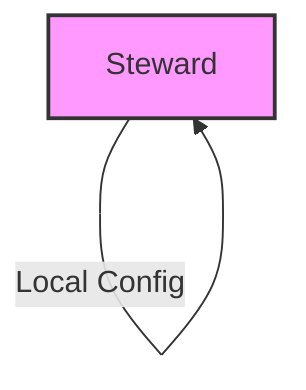
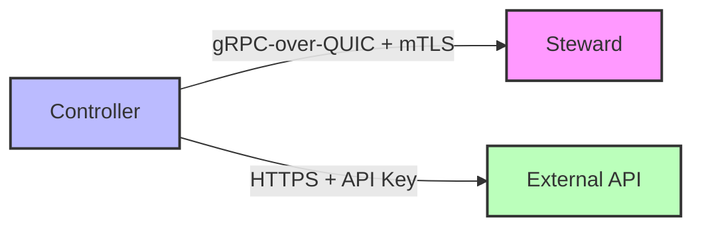
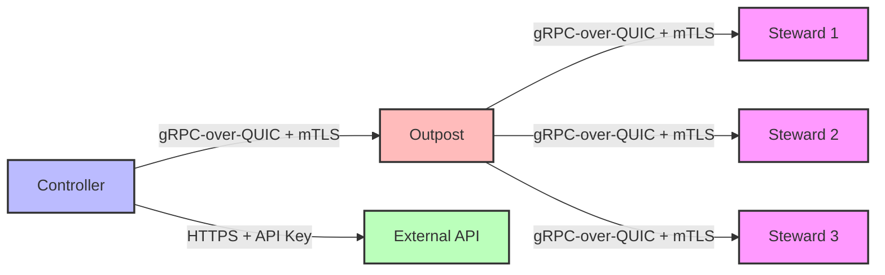
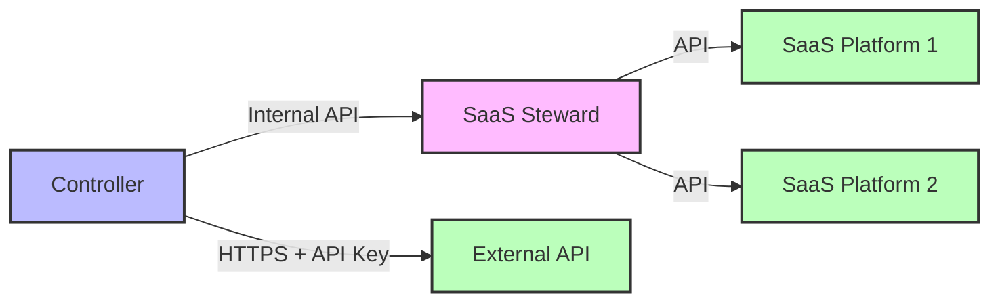
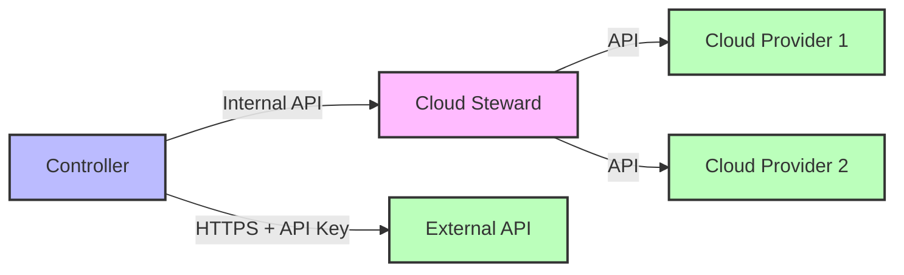

# CFGMS Component Terminology

This document defines the core components of the CFGMS (Configuration Management System) and their roles within the system architecture.

## Core Components

### Controller

The **Controller** is the central management server of the CFGMS system.

**Primary Responsibilities:**

- Manages the entire configuration management system
- Distributes configuration data to Stewards and Outposts
- Processes and validates configuration changes
- Manages the tenant hierarchy
- Implements the REST API for external access
- Handles authentication and authorization
- Processes DNA (system-specific metadata) information

**Key Characteristics:**

- Designed for high availability and scalability
- Can handle 10,000+ Stewards per controller instance
- Supports geo-distributed deployment
- Implements robust security controls

### Steward

The **Steward** is the cross-platform component that runs on managed endpoints.

**Primary Responsibilities:**

- Executes configuration management tasks on endpoints
- Reports system state back to the Controller
- Implements the module system for resource management
- Collects and reports DNA (system-specific metadata)
- Enforces configuration compliance

**Key Characteristics:**

- Runs on Windows, Linux, and macOS
- Self-contained Go binary with minimal dependencies
- Self-healing architecture with blue-green upgrade capability
- Operates independently when disconnected from Controller
- Implements automatic recovery from failures

### Outpost

The **Outpost** is a specialized proxy cache component with network monitoring capabilities.

**Primary Responsibilities:**

- Acts as a proxy cache for Stewards on a network
- Monitors netflow and SNMP data from network devices
- Provides agentless monitoring of IoT devices on the network
- Caches configuration data and binaries for local Stewards
- Reduces network traffic between Stewards and Controller

**Key Characteristics:**

- Optimizes network usage in large deployments
- Enables monitoring of devices that cannot run a Steward
- Provides local caching for improved performance
- Implements network discovery capabilities
- Supports passive network monitoring

### Specialized Stewards

CFGMS includes specialized Steward variants that extend the core functionality to specific environments. Unlike the standard Steward, these specialized components are not installed on managed endpoints but are deployed as services that integrate with the Controller.

#### SaaS Steward (v2)

The **SaaS Steward** is a specialized component for managing SaaS environments.

**Primary Responsibilities:**

- Manages SaaS application configurations
- Handles SaaS tenant administration
- Implements SaaS-specific modules
- Monitors SaaS application health
- Enforces SaaS compliance policies

**Key Characteristics:**

- Specialized for SaaS environment management
- Supports multiple SaaS platforms (e.g., M365, QuickBooks Online)
- Implements SaaS-specific security controls
- Provides SaaS tenant isolation
- Enables SaaS configuration automation

**Deployment Options:**

- As a Controller plugin (simplest deployment)
- As a standalone service alongside the Controller
- As a serverless function for cloud-native deployments
- As a containerized service for Kubernetes environments

#### Cloud Steward (v2)

The **Cloud Steward** is a specialized component for managing cloud environments.

**Primary Responsibilities:**

- Manages cloud infrastructure configurations
- Handles cloud resource provisioning and lifecycle
- Implements cloud-specific modules
- Monitors cloud resource health and performance
- Enforces cloud compliance policies

**Key Characteristics:**

- Specialized for cloud environment management
- Supports multiple cloud platforms (e.g., AWS, Azure, GCP)
- Manages various cloud resource types:

  - Virtual Machines
  - Containers
  - Serverless Functions
  - Cloud Networks
  - Storage Resources
- Implements cloud-specific security controls
- Provides cloud resource isolation
- Enables cloud configuration automation

**Deployment Options:**

- As a Controller plugin (simplest deployment)
- As a standalone service alongside the Controller
- As a serverless function for cloud-native deployments
- As a containerized service for Kubernetes environments

## Component Interactions

### Basic Deployment (Steward-Only)

In the most basic deployment, a single Steward operates independently with local configuration:

### Typical Deployment (Controller-Steward)

Standard deployment with direct communication between Controller and Steward:

### Large Environment (Controller-Outpost-Steward)

Large deployments with Outpost acting as a local proxy-cache:

### SaaS Environment (Controller-SaaS Steward)

SaaS environment management with SaaS Steward:

### Cloud Environment (Controller-Cloud Steward)

Cloud environment management with Cloud Steward:

## Deployment Flexibility

CFGMS is designed to be both simple to get started with and capable of scaling to any size:

### Simple Deployment

- Single Controller with standard Stewards
- Minimal configuration required
- Automatic discovery and onboarding
- Zero-touch deployment options

### Scalable Deployment

- Distributed Controller architecture
- Hierarchical Controller management
- Outpost deployment for network optimization
- Specialized Stewards for different environments
- Multi-tenant support with recursive parent-child model

### Deployment Options for Specialized Stewards

- **Controller Plugin**: Simplest option, runs within the Controller process
- **Standalone Service**: Runs alongside the Controller for better resource isolation
- **Serverless Function**: Cloud-native deployment for automatic scaling
- **Containerized Service**: Kubernetes-friendly deployment for orchestrated environments

## Related Terms

### DNA (System-Specific Metadata)

DNA refers to system-specific metadata used for targeting and identification, creating a comprehensive digital twin of the physical environment. This includes:

- Hardware information (CPU, memory, storage, network interfaces)
- Operating system details (version, patches, installed software)
- Network configuration (IP addresses, DNS, routing)
- Physical location and environment (datacenter, rack, room)
- System relationships and dependencies
- Performance metrics and health status
- Custom attributes and business context
- Historical state and change tracking
- Security posture and compliance status
- Resource utilization and capacity planning data

The DNA system continuously updates this digital twin through:

- Real-time monitoring and state detection
- Automated discovery of system changes
- Integration with external data sources
- Historical tracking of configuration changes
- Relationship mapping between systems
- Performance and health metrics collection

### Module

A **Module** is an out-of-process gRPC binary that manages a specific resource type. The steward (or workflow engine) spawns the module binary as a child process; the module communicates back over a local Unix socket or named pipe using the CFGMS module gRPC API. Every module implements the standard contract: `Handshake` / `Get` / `Set` / `Test` / `Shutdown`. Modules commit to exactly one kind (`steward`, `outpost`, or `workflow`) via `executors:` in `module.yaml`.

**Disambiguation**: "Module" is not the same as "pluggable provider." Pluggable providers (storage, logging, secrets, etc.) are central infrastructure backends. Modules are resource-management units that run on endpoints or the controller. See **Pluggable provider** below.

### Module bundle

A **module bundle** is a signed archive containing the module binary (cross-compiled for each supported `os-arch`), the `module.yaml` manifest, and one or more Ed25519 detached signatures. Bundles are content-addressed by the four-tuple `(publisher, name, version, content_hash)`. The content hash makes silent bundle mutation detectable — any change to binary content or manifest produces a different hash and therefore a different cache entry.

### Module contract

The **module contract** is the gRPC API that every CFGMS module must implement. It is defined in `api/proto/modules/` and documented in [`docs/architecture/modules/interface.md`](modules/interface.md). The contract has two variants: `ModuleService` (steward and outpost modules) and `WorkflowModuleService` (workflow modules). The only difference is the `Handshake` message, which carries the calling context. `Get`, `Set`, `Test`, and `Shutdown` messages are shared.

### Module runtime

The **module runtime** is the host-side component that manages the module process lifecycle: spawn, health-check, graceful shutdown. On a steward the module runtime is part of the steward binary. On the controller the module runtime is embedded in the workflow engine. The module runtime enforces the behavioral envelope declared in `module.yaml` where OS primitives support it (Linux namespaces, Windows Job Objects, macOS sandbox).

### Module host

A **module host** is the system component that owns a module runtime: the steward for `steward`- and `outpost`-kind modules, and the controller workflow engine for `workflow`-kind modules. The module host is responsible for fetching the bundle, verifying the content hash and trust, spawning the binary, and enforcing the behavioral envelope.

### Publisher

A **publisher** is the identity whose Ed25519 signing key is in a module bundle's signature block. Publisher public keys are baked into the steward binary at build time — they cannot be changed via `cfg push` or any runtime configuration path. The `publisher` field in `module.yaml` must match a registered publisher identity. CFGMS ships a built-in publisher identity (`cfgms`) for stdlib modules; third-party publishers require a steward binary rebuild to add their key to the trusted set.

### Workflow module

A **workflow module** is a module with `executors: [workflow]` in `module.yaml`. Workflow modules run on the controller's workflow engine against cloud and SaaS APIs (e.g. M365, identity providers, ticketing systems). They do not run on endpoints. The workflow engine dials the module process over a local socket and provides a tenant-scoped auth token in the `WorkflowHandshakeRequest`.

### Steward module

A **steward module** is a module with `executors: [steward]` in `module.yaml`. Steward modules run on the endpoint where the steward is installed and manage local resources on that device (files, packages, firewall rules, services, registry keys). Steward modules may use localhost transports (e.g. direct WMI) but never span to other hosts.

### Outpost module

An **outpost module** is a module with `executors: [outpost]` in `module.yaml`. Outpost modules run on a steward host but manage remote LAN devices — network gear, printers, IoT devices, or hypervisors that cannot run a steward themselves. The outpost module uses the steward as a proxy agent. The outpost runtime is reserved in ADR-006; its process model is not yet defined.

### Pluggable provider

A **pluggable provider** is a backend implementation of a central CFGMS infrastructure interface (storage, logging, secrets, directory, control-plane transport, data-plane transport). Pluggable providers live under `pkg/*/providers/` and are selected via YAML configuration at runtime. They register themselves at startup via `init()`.

**Disambiguation from Module**: "Pluggable provider" refers strictly to the central-provider pattern described in `pkg/README.md` and [`docs/architecture/provider-architecture.md`](provider-architecture.md). Modules are a distinct concept: they manage endpoint resources, run out-of-process, and use a different interface (`ModuleService` gRPC). The terms "provider", "plugin", and "pluggable" in CFGMS documentation always refer to the central-provider pattern unless the surrounding context explicitly says "module."

### Configuration-Data

A declarative specification of desired state for one or more resources, typically in YAML format.

### Resource

A manageable entity (e.g., users, groups, web servers, applications).

### Endpoint

A managed system or service that a Steward is responsible for.

## Version Information

- **Document Version:** 1.5
- **Last Updated:** 2026-06-09
- **Status:** Current
- **Changes:** Added module system terminology (Module, Module bundle, Module contract, Module runtime, Module host, Publisher, Workflow module, Steward module, Outpost module, Pluggable provider)
